# Agent Gateway Auth Patterns

A practical guide to the authentication patterns supported by agentgateway. Each pattern is tagged with the **minimum tier** required (**OSS** or **Enterprise**), with a "when to use," a YAML snippet, and a diagram.

> **Documentation:** [docs.solo.io/agentgateway/2.2.x](https://docs.solo.io/agentgateway/2.2.x/) · [Enterprise API](https://docs.solo.io/agentgateway/2.2.x/reference/api/solo/) · [OSS API](https://docs.solo.io/agentgateway/2.2.x/reference/api/api/) · [Helm Values](https://docs.solo.io/agentgateway/2.2.x/reference/helm/agentgateway/)

---

## Tier Legend

| Tag | Meaning |
|---|---|
| **[OSS]** | Configurable using only the OSS `agentgateway.dev` API surface — works on the standalone OSS Rust binary and on Solo Enterprise clusters. The capability ships in the open-source data plane. |
| **[Enterprise]** | Requires **Solo Enterprise for agentgateway**. Depends on one or more enterprise-only components: the `EnterpriseAgentgatewayPolicy` / `AuthConfig` CRDs (`enterpriseagentgateway.solo.io`, `extauth.solo.io`), the Enterprise external auth service, the built-in **STS** (Security Token Service), or the **Solo Enterprise UI**. |

> **How this was classified.** Each tier tag was validated against the OSS proto (`agentgateway/crates/protos/proto/resource.proto`) and the Enterprise proto (`agentgateway-enterprise/crates/protos/proto/resource.proto`). The single auth feature gated to the Enterprise proto today is `BackendAuthPolicy.token_exchange` (with `EXCHANGE_ONLY` and `ELICIT_ONLY` modes) — every Token-Exchange-based pattern below transitively requires Enterprise.

> **A note on hybrid usage.** On Kubernetes, you typically install Solo Enterprise even when using "OSS" patterns, because the Enterprise control plane reconciles both `agentgateway.dev` (OSS) and `enterpriseagentgateway.solo.io` (Enterprise wrapper) CRDs. **OSS** here means "the underlying capability is in the OSS data plane and you can run it standalone." **Enterprise** means there is no equivalent in the OSS binary alone.

---

## Table of Contents

- [Quick Selection Guide](#quick-selection-guide)
- [At a Glance: All Patterns](#at-a-glance-all-patterns)
- [Inbound Authentication](#inbound-authentication)
  - [API Key Auth](#api-key-auth-oss) — [OSS]
  - [Basic Auth (RFC 7617)](#basic-auth-rfc-7617-oss) — [OSS]
  - [BYO External Auth (gRPC ext_authz)](#byo-external-auth-grpc-ext_authz-oss) — [OSS]
  - [Standard OIDC / JWT Authentication](#standard-oidc--jwt-authentication-oss) — [OSS]
  - [Mutual TLS (mTLS)](#mutual-tls-mtls-oss) — [OSS]
  - [MCP OAuth with Dynamic Client Registration](#mcp-oauth-with-dynamic-client-registration-oss) — [OSS]
- [Token Exchange](#token-exchange)
  - [Gateway-Mediated OIDC + Token Exchange](#gateway-mediated-oidc--token-exchange-enterprise) — [Enterprise]
  - [OBO Delegation (Dual Identity)](#obo-delegation-dual-identity-enterprise) — [Enterprise]
  - [OBO Impersonation (Token Swap)](#obo-impersonation-token-swap-enterprise) — [Enterprise]
  - [Double OAuth Flow (OIDC + Elicitation)](#double-oauth-flow-oidc--elicitation-enterprise) — [Enterprise]
- [Upstream / Backend Auth](#upstream--backend-auth)
  - [Passthrough Token](#passthrough-token-oss) — [OSS]
  - [Static Secret Injection (Shared Credential)](#static-secret-injection-shared-credential-oss) — [OSS]
  - [Claim-Based Token Mapping](#claim-based-token-mapping-oss) — [OSS]
- [Credential Gathering](#credential-gathering)
  - [Elicitation](#elicitation-enterprise) — [Enterprise]
- [Decision Flowchart](#decision-flowchart)
- [Glossary](#glossary)

---

## Quick Selection Guide

Pick the **first** pattern that matches your scenario:

| If you need to… | Use this pattern | Tier |
|---|---|---|
| Let machine clients (CI, scripts) authenticate with a long-lived secret | [API Key Auth](#api-key-auth-oss) | OSS |
| Authenticate humans/services with username + password | [Basic Auth](#basic-auth-rfc-7617-oss) | OSS |
| Validate end-user JWTs from an existing IdP (Okta, Auth0, Keycloak, Entra) | [Standard OIDC / JWT](#standard-oidc--jwt-authentication-oss) | OSS |
| Authenticate clients with X.509 certificates (no app-layer credentials) | [Mutual TLS](#mutual-tls-mtls-oss) | OSS |
| Plug in a custom auth service (existing IAM, MFA, fraud checks) | [BYO External Auth](#byo-external-auth-grpc-ext_authz-oss) | OSS |
| Onboard MCP clients (Claude Code, VS Code) with no pre-registered creds | [MCP OAuth + DCR](#mcp-oauth-with-dynamic-client-registration-oss) | OSS |
| Replace the IdP token with a gateway-issued token before reaching agents | [Gateway-Mediated OIDC + Token Exchange](#gateway-mediated-oidc--token-exchange-enterprise) | Enterprise |
| Carry **both** user and agent identity to downstream services | [OBO Delegation](#obo-delegation-dual-identity-enterprise) | Enterprise |
| Carry the user's identity only, replacing the IdP token | [OBO Impersonation](#obo-impersonation-token-swap-enterprise) | Enterprise |
| Have one user complete OAuth flows for two different APIs in sequence | [Double OAuth Flow](#double-oauth-flow-oidc--elicitation-enterprise) | Enterprise |
| Forward the client's original `Authorization` header to the backend | [Passthrough Token](#passthrough-token-oss) | OSS |
| Inject a single shared API key for all users into upstream calls | [Static Secret Injection](#static-secret-injection-shared-credential-oss) | OSS |
| Inject a different upstream key per user, team, or tier | [Claim-Based Token Mapping](#claim-based-token-mapping-oss) | OSS |
| Prompt users to authorize a third-party API on demand | [Elicitation](#elicitation-enterprise) | Enterprise |

---

## At a Glance: All Patterns

| Pattern | Tier | Direction | Identity carried downstream | Best for |
|---|---|---|---|---|
| API Key Auth | OSS | Inbound | Secret-name → `x-user-id` | Service accounts, CI/CD |
| Basic Auth | OSS | Inbound | Username | Internal tools, low-friction APIs |
| BYO External Auth | OSS | Inbound | Whatever your service returns | Custom auth, MFA, legacy IAM |
| Standard OIDC / JWT | OSS | Inbound | JWT claims (`sub`, `email`, …) | End-user APIs behind an IdP |
| Mutual TLS | OSS | Inbound + outbound | Client cert SAN/CN | Service-to-service, zero-trust |
| MCP OAuth + DCR | OSS | Inbound | OAuth identity | MCP clients with no pre-reg creds |
| Gateway-Mediated OIDC + Token Exchange | Enterprise | Token exchange | Gateway-issued JWT (`sub` + `act`) | Decoupling agents from the IdP |
| OBO Delegation | Enterprise | Token exchange | Gateway-issued JWT (`sub` + `act`) | Auditable user-on-behalf-of-agent |
| OBO Impersonation | Enterprise | Token exchange | Gateway-issued JWT (`sub` only) | Hiding IdP tokens from agents |
| Double OAuth Flow | Enterprise | Token exchange | Downstream JWT + upstream token | Agents calling 3rd-party APIs as user |
| Passthrough Token | OSS | Outbound | Original client token | Federated identity, opaque tokens |
| Static Secret Injection | OSS | Outbound | Shared credential | One backend key, many users |
| Claim-Based Token Mapping | OSS | Outbound | Per-claim mapped credential | Tiered access, per-team API keys |
| Elicitation | Enterprise | Outbound | Per-user upstream OAuth token | On-demand 3rd-party authorization |

> The YAML snippets below favor **OSS `AgentgatewayPolicy`** wherever it works (so the same config runs on the standalone binary). Where the workshop demo uses an `EnterpriseAgentgatewayPolicy` wrapper, that is called out explicitly.

---

# Inbound Authentication

Patterns that authenticate the client calling the gateway.

---

## API Key Auth `[OSS]`

> **When to use:** Machine clients (CI jobs, scripts, internal services) that need a stable, long-lived credential. Avoid for end-user traffic — keys leak, don't expire, and can't carry rich identity claims.

Clients authenticate with a static API key. The OSS `apiKeyAuthentication` policy validates the key inline, and Solo Enterprise extends this via `AuthConfig` to validate keys stored as labelled Kubernetes secrets and emit an `x-user-id` header for downstream rate limiting and audit.

**Trade-offs:** Simple to roll out and easy for clients to integrate. No native expiry — pair with rate limiting and audit logging.

### YAML — OSS (inline keys)

```yaml
apiVersion: agentgateway.dev/v1alpha1
kind: AgentgatewayPolicy
metadata:
  name: api-key-auth
  namespace: agentgateway-system
spec:
  targetRefs:
    - group: gateway.networking.k8s.io
      kind: HTTPRoute
      name: my-route
  traffic:
    apiKeyAuthentication:
      mode: Strict             # OPTIONAL | STRICT | PERMISSIVE
      apiKeys:
        - key: ci-system-key-abc123
          metadata:
            user: ci-system
        - key: team-alpha-key-def456
          metadata:
            team: alpha
```

### YAML — Enterprise (secret-backed, with user-identity mapping)

```yaml
apiVersion: v1
kind: Secret
metadata:
  name: team-alpha-key
  namespace: agentgateway-system
  labels:
    provider: openai
type: extauth.solo.io/apikey
stringData:
  api-key: N2YwMDIxZTEtNGUzNS1jNzgzLTRkYjAtYjE2YzRkZGVmNjcy
---
apiVersion: extauth.solo.io/v1
kind: AuthConfig
metadata:
  name: apikey-auth
  namespace: agentgateway-system
spec:
  configs:
    - apiKeyAuth:
        headerName: x-api-key
        labelSelector:
          provider: openai     # match all secrets with this label
---
apiVersion: enterpriseagentgateway.solo.io/v1alpha1
kind: EnterpriseAgentgatewayPolicy
metadata:
  name: apikey-auth
  namespace: agentgateway-system
spec:
  targetRefs:
    - group: gateway.networking.k8s.io
      kind: Gateway
      name: agentgateway-proxy
  traffic:
    entExtAuth:
      authConfigRef:
        name: apikey-auth
      backendRef:
        name: ext-auth-service-enterprise-agentgateway
        namespace: agentgateway-system
        port: 8083
```

> **Docs:** [API Key Auth](https://docs.solo.io/agentgateway/2.2.x/security/extauth/apikey/)
> **API:** [APIKeyAuthentication (OSS)](https://docs.solo.io/agentgateway/2.2.x/reference/api/api/#apikeyauthentication) · [APIKeyAuthentication (Enterprise)](https://docs.solo.io/agentgateway/2.2.x/reference/api/solo/#apikeyauthentication)

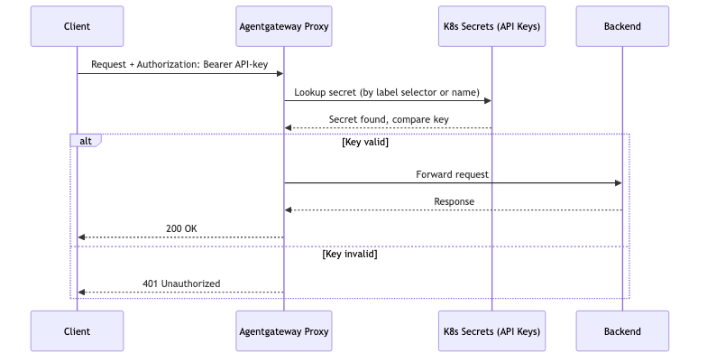

---

## Basic Auth (RFC 7617) `[OSS]`

> **When to use:** Internal tools and low-stakes APIs where you already have htpasswd-style credentials. Not recommended for production end-user traffic — credentials travel on every request and can't be revoked individually without a re-deploy.

Clients send `Authorization: Basic <base64(user:pass)>`. The gateway validates against APR1/bcrypt-hashed credentials. Storage is mutually exclusive: inline `htpasswdContent` (OSS) **or** a `users` field / `secretRef` to an htpasswd file (Enterprise).

### YAML — OSS

```yaml
apiVersion: agentgateway.dev/v1alpha1
kind: AgentgatewayPolicy
metadata:
  name: basic-auth
  namespace: agentgateway-system
spec:
  targetRefs:
    - group: gateway.networking.k8s.io
      kind: HTTPRoute
      name: my-route
  traffic:
    basicAuthentication:
      mode: Strict
      realm: agentgateway
      # Generate with: htpasswd -nbB alice 'p4ssword'
      htpasswdContent: |
        alice:$2y$05$dCv...redacted...
        bob:$2y$05$Hke...redacted...
```

> **Docs:** [Basic Auth](https://docs.solo.io/agentgateway/2.2.x/security/extauth/basic/)
> **API:** [BasicAuthentication (OSS)](https://docs.solo.io/agentgateway/2.2.x/reference/api/api/#basicauthentication) · [BasicAuthentication (Enterprise)](https://docs.solo.io/agentgateway/2.2.x/reference/api/solo/#basicauthentication)


---

## BYO External Auth (gRPC ext_authz) `[OSS]`

> **When to use:** You already have an authentication service (legacy IAM, MFA gateway, fraud-detection) and want the gateway to delegate decisions instead of duplicating logic. Also fits scenarios needing custom auth logic the built-in patterns don't cover.

Delegate auth to your own service via the Envoy `ext_authz` protocol (gRPC or HTTP). The gateway sends a `CheckRequest` for each request; your service returns allow/deny plus optional headers to inject. Maximum flexibility, at the cost of one network hop per request.

> The OSS `extAuth` field calls your service directly. The Enterprise `entExtAuth` field uses an `AuthConfig` reference, which is what enables OAuth/OIDC, JWT-with-introspection, OPA, and other Solo Enterprise extauth modes.

### YAML — OSS (HTTP ext_authz)

This is the actual shape pulled from a live cluster — the gateway calls a service over HTTP and forwards the validated `Authorization` header back into the request:

```yaml
apiVersion: agentgateway.dev/v1alpha1
kind: AgentgatewayPolicy
metadata:
  name: ext-auth
  namespace: agentgateway-system
spec:
  targetRefs:
    - group: gateway.networking.k8s.io
      kind: HTTPRoute
      name: my-route
  traffic:
    extAuth:
      backendRef:
        kind: Service
        name: my-auth-service
        port: 80
      failureMode: FailClosed   # FailClosed | FailOpen | DenyWithStatus
      http:
        path: "/check"          # path on your auth service
        allowedResponseHeaders:
          - Authorization       # headers to forward from auth response into request
```

### YAML — OSS (gRPC ext_authz)

```yaml
spec:
  traffic:
    extAuth:
      backendRef:
        kind: Service
        name: my-grpc-auth-service
        port: 9001
      failureMode: FailClosed
      grpc:
        context:                # static context fields sent in CheckRequest
          environment: prod
```

> **Docs:** [BYO Ext Auth Service](https://docs.solo.io/agentgateway/2.2.x/security/extauth/byo-ext-auth-service/)
> **API:** [ExtAuth (OSS)](https://docs.solo.io/agentgateway/2.2.x/reference/api/api/#extauth) · [EnterpriseAgentgatewayExtAuth](https://docs.solo.io/agentgateway/2.2.x/reference/api/solo/#enterpriseagentgatewayextauth)

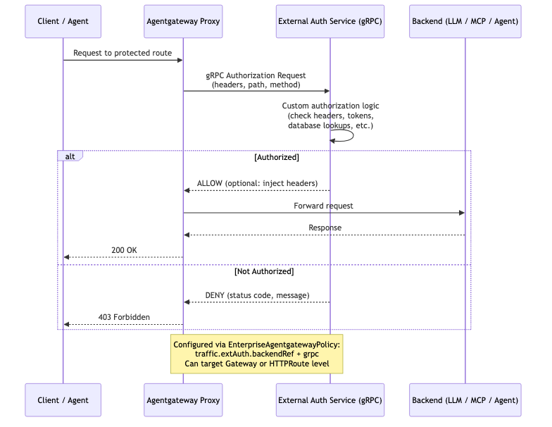

---

## Standard OIDC / JWT Authentication `[OSS]`

> **When to use:** End-user APIs where users authenticate at an existing IdP (Okta, Auth0, Keycloak, Entra ID) and present a JWT bearer token. Default modern choice for human-driven traffic.

The client obtains a JWT from an external OIDC provider (e.g., via Authorization Code Flow) and presents it as a bearer token. The gateway validates the JWT signature against the provider's JWKS endpoint, plus issuer and audience claims. The gateway does **not** participate in the OIDC redirect flow itself — it only validates tokens.

> For *gateway-initiated* Authorization Code Flow, see [Gateway-Mediated OIDC + Token Exchange](#gateway-mediated-oidc--token-exchange-enterprise) (Enterprise).

**Modes:** `Strict` (require valid JWT), `Optional` (validate if present), `Permissive` (never reject).

### YAML — OSS (remote JWKS, Keycloak)

```yaml
apiVersion: agentgateway.dev/v1alpha1
kind: AgentgatewayPolicy
metadata:
  name: jwt-auth
  namespace: agentgateway-system
spec:
  targetRefs:
    - group: gateway.networking.k8s.io
      kind: HTTPRoute
      name: my-route
  traffic:
    jwtAuthentication:
      mode: Strict
      providers:
        - issuer: "https://keycloak.example.com/realms/agents"
          audiences: ["my-ai-application"]
          jwks:
            remote:
              jwksPath: "/realms/agents/protocol/openid-connect/certs"
              cacheDuration: "5m"
              backendRef:
                kind: Service
                name: keycloak
                namespace: keycloak
                port: 8080
```

### YAML — OSS (inline JWKS, multi-provider)

Pulled from a live cluster — useful for tests and air-gapped setups:

```yaml
apiVersion: agentgateway.dev/v1alpha1
kind: AgentgatewayPolicy
metadata:
  name: jwt-test
  namespace: jwt-test
spec:
  targetRefs:
    - group: gateway.networking.k8s.io
      kind: HTTPRoute
      name: echo
  traffic:
    jwtAuthentication:
      mode: Strict
      providers:
        - issuer: test-issuer
          audiences: [test]
          jwks:
            inline: |
              {"keys":[{"kty":"RSA","use":"sig","alg":"RS256","kid":"test-key-1","n":"...","e":"AQAB"}]}
        - issuer: "https://login.microsoftonline.com/<tenant-id>/v2.0"
          audiences: ["api://<client-id>"]
          jwks:
            remote:
              jwksPath: "/common/discovery/v2.0/keys"
              backendRef:
                kind: Service
                name: entra-id-proxy
                namespace: auth-system
                port: 443
    authorization:
      action: Allow
      policy:
        matchExpressions:
          - jwt.sub == "agent-service"     # CEL on validated claims
```

> **Docs:** [Set up JWT Auth](https://docs.solo.io/agentgateway/2.2.x/security/jwt/setup/) · [JWT Auth for MCP Services](https://docs.solo.io/agentgateway/2.2.x/mcp/mcp-access/) · [Keycloak as IdP](https://docs.solo.io/agentgateway/2.2.x/security/extauth/oauth/keycloak/)
> **API:** [JWTAuthentication (OSS)](https://docs.solo.io/agentgateway/2.2.x/reference/api/api/#jwtauthentication) · [JWTAuthentication (Enterprise)](https://docs.solo.io/agentgateway/2.2.x/reference/api/solo/#jwtauthentication)

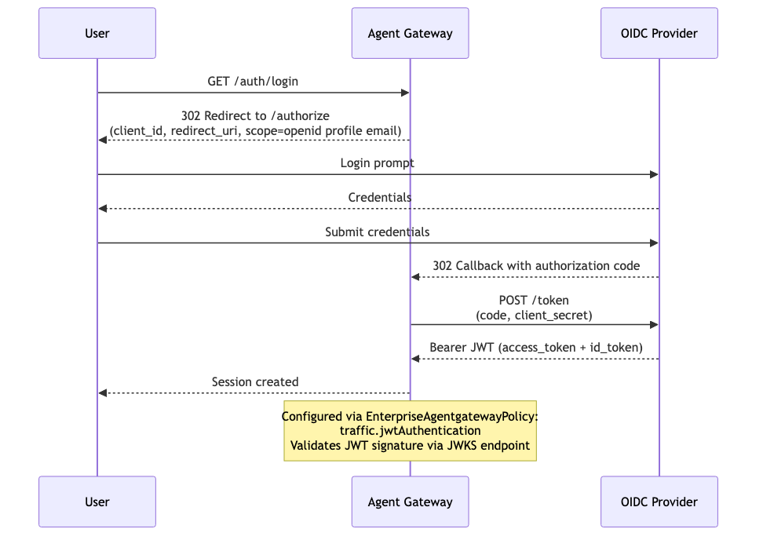

---

## Mutual TLS (mTLS) `[OSS]`

> **When to use:** Service-to-service traffic in a zero-trust network, or when you want a credential bound to a workload identity (cert) rather than a user. Combine `FrontendTLS` + `BackendTLS` for end-to-end encryption.

Two independent TLS features:

- **FrontendTLS (inbound mTLS):** clients present an X.509 cert at the TLS handshake; the gateway validates it against `caCertificateRefs`. Modes: `Strict` (default — reject invalid/missing certs) or `AllowInsecureFallback`.
- **BackendTLS (outbound TLS origination):** the gateway opens a TLS connection to the backend. Configured either as a standalone Gateway-API `BackendTLSPolicy` or inline via `backend.tls` on a policy.

### YAML — Inbound mTLS (Gateway resource)

```yaml
apiVersion: gateway.networking.k8s.io/v1
kind: Gateway
metadata:
  name: agentgateway-proxy
  namespace: agentgateway-system
spec:
  gatewayClassName: agentgateway
  listeners:
    - name: https
      protocol: HTTPS
      port: 443
      tls:
        mode: Terminate
        certificateRefs:
          - kind: Secret
            name: server-tls
        frontendValidation:
          caCertificateRefs:        # CA used to validate client certs
            - kind: ConfigMap
              name: client-ca
```

### YAML — Outbound BackendTLS (standalone policy)

```yaml
apiVersion: gateway.networking.k8s.io/v1
kind: BackendTLSPolicy
metadata:
  name: my-backend-tls
  namespace: agentgateway-system
spec:
  targetRefs:
    - group: ""
      kind: Service
      name: secured-upstream
  validation:
    hostname: api.upstream.example.com
    caCertificateRefs:
      - kind: ConfigMap
        name: upstream-ca
        group: ""
```

### YAML — Outbound BackendTLS (inline on AgentgatewayPolicy)

```yaml
apiVersion: agentgateway.dev/v1alpha1
kind: AgentgatewayPolicy
metadata:
  name: backend-tls-inline
  namespace: agentgateway-system
spec:
  targetRefs:
    - group: ""
      kind: Service
      name: secured-upstream
  backend:
    tls:
      verification: Strict          # Strict | InsecureHost | InsecureAll
      hostname: api.upstream.example.com
      # Or use system roots: wellKnownCACertificates: System
```

> **Docs:** [Set up mTLS (FrontendTLS)](https://docs.solo.io/agentgateway/2.2.x/setup/listeners/mtls/) · [BackendTLS](https://docs.solo.io/agentgateway/2.2.x/security/backendtls/)
> **API:** [FrontendTLS (OSS)](https://docs.solo.io/agentgateway/2.2.x/reference/api/api/#frontendtls) · [BackendTLS (OSS)](https://docs.solo.io/agentgateway/2.2.x/reference/api/api/#backendtls) · [BackendTLS (Enterprise)](https://docs.solo.io/agentgateway/2.2.x/reference/api/solo/#backendtls)

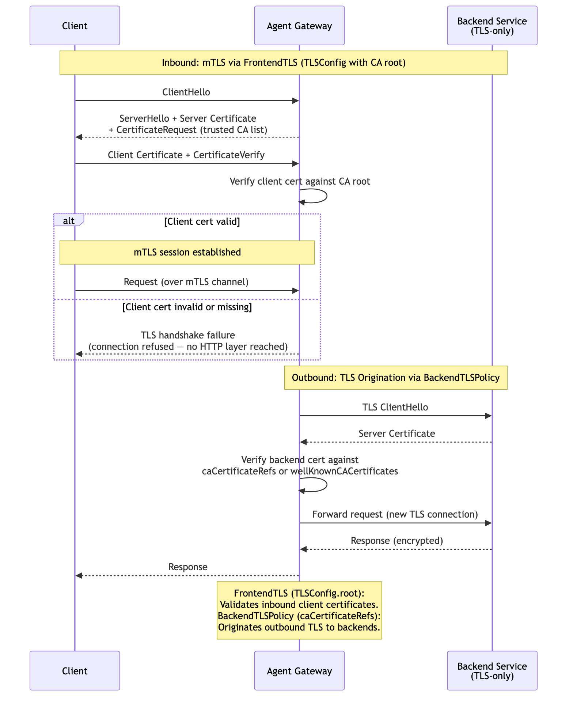

---

## MCP OAuth with Dynamic Client Registration `[OSS]`

> **When to use:** You're exposing MCP servers and your clients (Claude Code, VS Code extensions, in-house agents) need to onboard automatically without an admin pre-registering OAuth credentials.

The gateway exposes the MCP server's OAuth metadata at `.well-known/oauth-protected-resource/<path>` and `.well-known/oauth-authorization-server/<path>`, validates inbound bearer tokens, and brokers Dynamic Client Registration (RFC 7591) at the configured IdP. Built-in adapters cover spec-compliant providers, Keycloak (non-spec — needs metadata adaptation), and Auth0.

> **OSS vs. Enterprise:** The MCP authentication broker is in OSS (validated against the OSS proto and `examples/mcp-authentication/config.yaml`). DCR support comes from the IdP — agentgateway just brokers the OAuth metadata and validates JWTs. The Solo Enterprise UI is **not required**, but if you also want a managed admin UI for MCP server registration and a single per-cluster OAuth experience, that is part of Solo Enterprise.

### YAML — OSS (Keycloak with metadata adapter)

```yaml
apiVersion: agentgateway.dev/v1alpha1
kind: AgentgatewayPolicy
metadata:
  name: mcp-oauth
  namespace: agentgateway-system
spec:
  targetRefs:
    - group: gateway.networking.k8s.io
      kind: HTTPRoute
      name: mcp-server
  backend:
    mcpAuthentication:
      mode: Strict
      issuer: "http://keycloak.example.com/realms/mcp"
      audiences: ["mcp_proxy"]
      jwks:
        url: "http://keycloak.example.com/realms/mcp/protocol/openid-connect/certs"
      provider:
        keycloak: {}                # adapter for non-spec-compliant Keycloak
      resourceMetadata:
        resource: "https://gateway.example.com/keycloak/mcp"
        scopesSupported: [openid, profile, offline_access]
        bearerMethodsSupported: [header]
```

### YAML — Standalone OSS binary (JSON-config style)

```yaml
# yaml-language-server: $schema=https://agentgateway.dev/schema/config
binds:
  - port: 3000
    listeners:
      - routes:
          - matches:
              - path: { exact: /mcp }
              - path: { exact: /.well-known/oauth-protected-resource/mcp }
              - path: { exact: /.well-known/oauth-authorization-server/mcp }
            policies:
              mcpAuthentication:
                mode: strict
                issuer: http://keycloak:7080/realms/mcp
                audiences: [mcp_proxy]
                jwks: { url: http://keycloak:7080/realms/mcp/protocol/openid-connect/certs }
                provider: { keycloak: {} }
                resourceMetadata:
                  resource: http://localhost:3000/mcp
                  scopesSupported: [openid, profile, offline_access]
            backends:
              - mcp:
                  targets:
                    - name: tools
                      stdio:
                        cmd: npx
                        args: ["@modelcontextprotocol/server-everything"]
```

> **Docs:** [About MCP Auth](https://docs.solo.io/agentgateway/2.2.x/mcp/auth/about/) · [Set up Keycloak for MCP Auth](https://docs.solo.io/agentgateway/2.2.x/mcp/auth/keycloak/)


---

# Token Exchange

Patterns that take an inbound token and transform it before it reaches downstream services. **All require Solo Enterprise** — the `BackendAuthPolicy.tokenExchange` field exists only in the Enterprise proto.

---

## Gateway-Mediated OIDC + Token Exchange `[Enterprise]`

> **When to use:** You want agents to trust **only the gateway's STS issuer** — never the external IdP directly. Useful for decoupling agents from IdP changes and for centralizing claim shaping.

The gateway handles OIDC authentication itself (via `entExtAuth` + an `AuthConfig` of type `oauth2.oidcAuthorizationCode`), then automatically exchanges the IdP token (via RFC 8693) before forwarding to the agent. The agent only ever sees the STS-issued JWT.

### YAML — Enterprise (OIDC + Built-in STS)

```yaml
apiVersion: v1
kind: Secret
metadata:
  name: idp-client-secret
  namespace: agentgateway-system
type: extauth.solo.io/oauth
stringData:
  client-secret: <idp-client-secret>
---
apiVersion: extauth.solo.io/v1
kind: AuthConfig
metadata:
  name: corporate-sso
  namespace: agentgateway-system
spec:
  configs:
    - oauth2:
        oidcAuthorizationCode:
          appUrl: "https://gateway.example.com"
          callbackPath: /callback
          clientId: <gateway-client-id>
          clientSecretRef:
            name: idp-client-secret
            namespace: agentgateway-system
          issuerUrl: "https://login.microsoftonline.com/<tenant>/v2.0/"
          scopes: [openid, profile, email]
          headers:
            idTokenHeader: jwt
---
apiVersion: enterpriseagentgateway.solo.io/v1alpha1
kind: EnterpriseAgentgatewayPolicy
metadata:
  name: oidc-and-exchange
  namespace: agentgateway-system
spec:
  targetRefs:
    - group: gateway.networking.k8s.io
      kind: Gateway
      name: agentgateway-proxy
  traffic:
    entExtAuth:
      authConfigRef: { name: corporate-sso }
      backendRef:
        name: ext-auth-service-enterprise-agentgateway
        namespace: agentgateway-system
        port: 8083
  backend:
    tokenExchange:
      mode: ExchangeOnly         # Variant A: built-in STS issues sub+act JWT
```

### Variant A: Built-in STS

Uses agentgateway's built-in token exchange server. `mode: ExchangeOnly`. STS issues a JWT with `sub` (user) + `act` (agent).

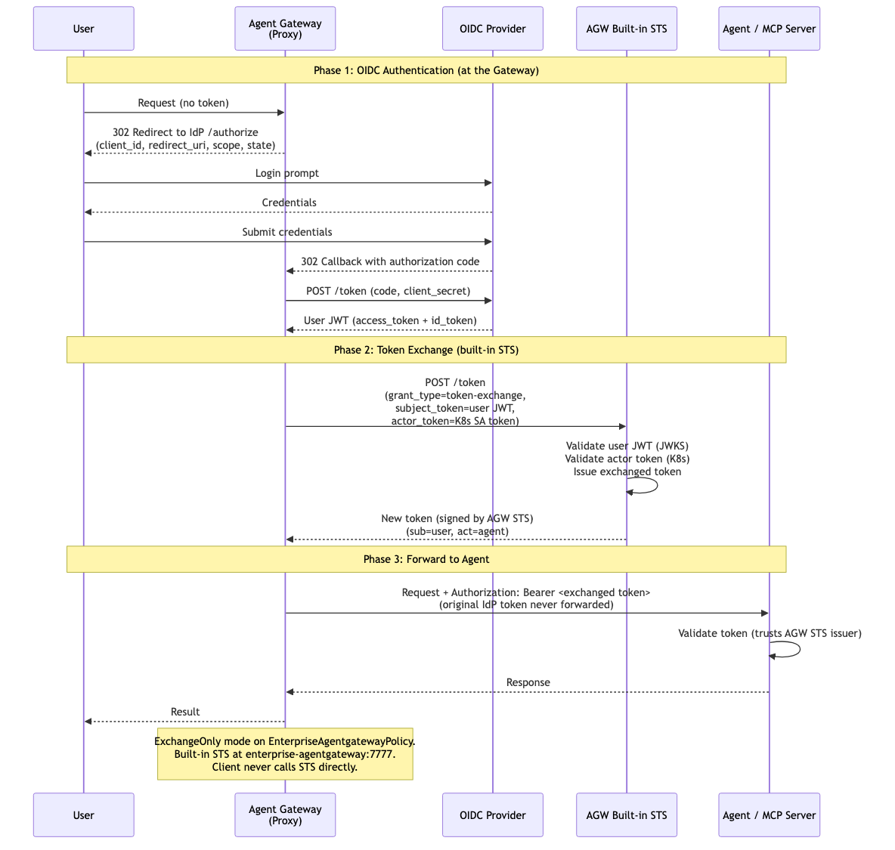

#### What the two tokens look like

**Input — User JWT** (issued by the IdP, received by the gateway after the OIDC dance):

```jsonc
// Header
{
  "alg": "RS256",
  "kid": "idp-key-2026-04",
  "typ": "JWT"
}
// Payload
{
  "iss": "https://login.example.com/realms/agents",
  "sub": "u-7f0a3c91",                       // the human user
  "aud": "agentgateway-browser",             // the gateway's IdP client_id
  "exp": 1777300000,
  "iat": 1777296400,
  "email": "alice@example.com",
  "name": "Alice Anderson",
  "scope": "openid profile email",
  "preferred_username": "alice"
}
```

**Output — Exchanged JWT** (issued by the AGW Built-in STS, forwarded to the agent):

```jsonc
// Header
{
  "alg": "RS256",
  "kid": "agw-sts-key-1",
  "typ": "JWT"
}
// Payload — RFC 8693 §4.1
{
  "iss": "https://agentgateway.example.com/sts",   // CHANGED: now the gateway's STS
  "sub": "u-7f0a3c91",                              // PRESERVED: same user
  "aud": "mcp-server.agents.svc",                   // CHANGED: now the agent/MCP server
  "exp": 1777296700,                                // SHORTER: typically minutes, not hours
  "iat": 1777296400,
  "scope": "mcp:invoke",                            // RESHAPED: only what the agent needs
  "act": {                                          // NEW: RFC 8693 actor claim
    "sub": "system:serviceaccount:agentgateway-system:agent-runtime",
    "iss": "https://kubernetes.default.svc"
  }
}
```

What changed and why:

| Field | User JWT | Exchanged JWT | Why |
|---|---|---|---|
| `iss` | IdP | AGW STS | Agent only trusts the STS issuer — IdP is invisible to it |
| `sub` | user id | user id | Preserved so downstream policy can authorize the user |
| `aud` | gateway client_id | agent / MCP server id | Token is now scoped to the resource it's actually calling |
| `exp` | hours | minutes | Exchange-only tokens are short-lived; gateway re-exchanges on demand |
| `scope` | full IdP scopes | minimum needed | Reshaped — agent doesn't need `email`, `profile` |
| `act` | (none) | `{sub: agent SA, iss: K8s}` | RFC 8693 actor claim — auditable agent-on-behalf-of-user |
| signature | IdP private key | AGW STS private key | Agent verifies against `<sts>/.well-known/jwks.json` |

> **OBO Impersonation** produces the same shape as the Exchanged JWT above but **omits the `act` claim** — downstream services see only the user.

### Variant B: External STS (Entra ID)

Uses Microsoft Entra ID as an external token-exchange provider via Entra's OBO flow (`urn:ietf:params:oauth:grant-type:jwt-bearer`).

```yaml
spec:
  backend:
    tokenExchange:
      mode: ExchangeOnly
      entra:
        clientId: <gateway-app-client-id>
        clientSecretRef: { name: entra-client-secret }
        tenantId: <tenant-id>
        scope: "https://graph.microsoft.com/.default"
```

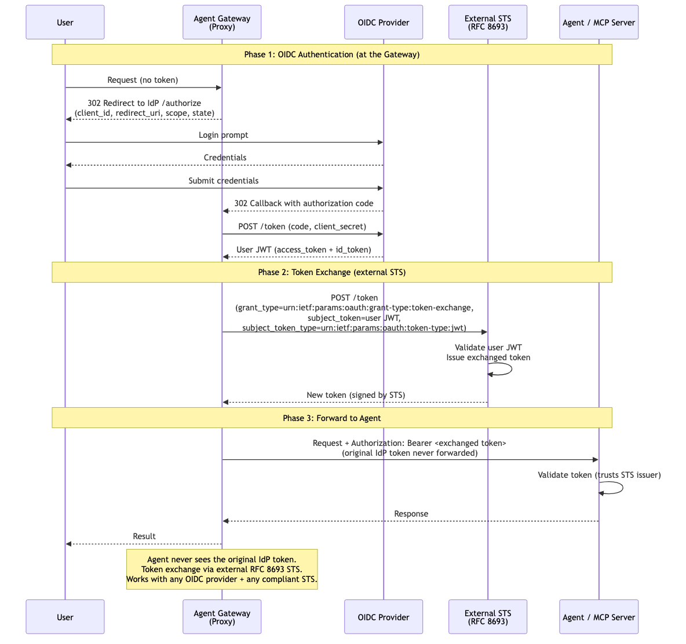

#### What the two tokens look like

> Unlike Variant A, the exchanged token here is **issued by Entra**, not by agentgateway. The agent validates against Entra's JWKS (`https://login.microsoftonline.com/<tenant>/discovery/v2.0/keys`).

**Input — User JWT** (issued by Entra ID, audience = the gateway's app registration):

```jsonc
// Header
{
  "alg": "RS256",
  "kid": "nOo3ZDrODXEK1jKWhXslHR_KXEg",
  "typ": "JWT"
}
// Payload — Entra v2.0 access token
{
  "iss": "https://login.microsoftonline.com/72f988bf-86f1-41af-91ab-2d7cd011db47/v2.0",
  "aud": "api://4ab8e9b1-...-gateway-app",   // the gateway's Entra app client_id
  "sub": "AAAAAA...user-pairwise-id",
  "oid": "5f6c2c8d-3e4d-4f8e-9b0a-1c2d3e4f5a6b", // stable Entra user object id
  "tid": "72f988bf-86f1-41af-91ab-2d7cd011db47", // tenant id
  "preferred_username": "alice@contoso.com",
  "name": "Alice Anderson",
  "scp": "User.Access",                         // Entra v2 uses `scp` not `scope`
  "ver": "2.0",
  "exp": 1777300000,
  "iat": 1777296400,
  "nbf": 1777296400
}
```

**OBO request the gateway makes to Entra** (server-to-server, no user redirect):

```http
POST https://login.microsoftonline.com/72f988bf-.../oauth2/v2.0/token
Content-Type: application/x-www-form-urlencoded

grant_type=urn:ietf:params:oauth:grant-type:jwt-bearer
client_id=4ab8e9b1-...-gateway-app
client_secret=<from clientSecretRef>
assertion=<the User JWT above>
scope=https://graph.microsoft.com/User.Read
requested_token_use=on_behalf_of
```

**Output — Exchanged JWT** (issued by Entra, audience = the target resource):

```jsonc
// Header
{
  "alg": "RS256",
  "kid": "nOo3ZDrODXEK1jKWhXslHR_KXEg",     // still Entra's signing key
  "typ": "JWT"
}
// Payload — Entra-issued, scoped to Microsoft Graph
{
  "iss": "https://login.microsoftonline.com/72f988bf-.../v2.0",
  "aud": "https://graph.microsoft.com",      // CHANGED: target resource, not the gateway
  "sub": "AAAAAA...graph-pairwise-id",       // CHANGED: pairwise sub for the new audience
  "oid": "5f6c2c8d-3e4d-4f8e-9b0a-1c2d3e4f5a6b", // PRESERVED: stable user identity
  "tid": "72f988bf-86f1-41af-91ab-2d7cd011db47",
  "preferred_username": "alice@contoso.com",
  "name": "Alice Anderson",
  "scp": "User.Read",                         // CHANGED: only the scope requested in the OBO call
  "azp": "4ab8e9b1-...-gateway-app",          // NEW: the app that performed the OBO (the gateway)
  "azpacr": "1",                              // NEW: auth method used (1 = client_secret)
  "ver": "2.0",
  "exp": 1777300000,
  "iat": 1777296400,
  "nbf": 1777296400
}
```

What changed and why:

| Field | User JWT | Exchanged JWT | Why |
|---|---|---|---|
| `iss` | Entra (your tenant) | Entra (your tenant) | Same issuer in both — Entra mints both tokens |
| `aud` | gateway app id | target resource (e.g. Graph) | Token is now scoped to the resource being called |
| `sub` | pairwise for gateway | pairwise for target resource | Entra issues a new pairwise `sub` per audience |
| `oid` | user object id | user object id | Stable across audiences — use this for "who is this user" |
| `scp` | full IdP scopes | only OBO-requested scope | Entra honors the `scope=` parameter in the OBO call |
| `azp` | (none) | gateway app id | RFC 7519 "authorized party" — records which app did the OBO |
| `act` | (none) | (none) | **Entra OBO does not emit RFC 8693 `act` — it's a Microsoft-flavored exchange, not the standard one** |
| signature | Entra | Entra | Agent verifies against Entra JWKS, not AGW STS |

> **Operational consequence:** Variant B's agent must be configured to trust **Entra** as the JWT issuer. With Variant A the agent trusts the **AGW STS** and the IdP is invisible — that's the main reason teams choose Variant A even when they're already on Entra.

> **Docs:** [OBO Token Exchange](https://docs.solo.io/agentgateway/2.2.x/security/obo-elicitations/obo/) · [Set up JWT Auth](https://docs.solo.io/agentgateway/2.2.x/security/jwt/setup/)
> **API / Helm:** [tokenExchange Helm values](https://docs.solo.io/agentgateway/2.2.x/reference/helm/agentgateway/)

---

## OBO Delegation (Dual Identity) `[Enterprise]`

> **When to use:** You need an audit trail showing **both** who the user is **and** which agent acted on their behalf. Common in agentic systems where multiple agents touch a single user request and you need attribution at each hop.

The agent exchanges the user's JWT for a delegated OBO token via RFC 8693. The user's JWT must include a `may_act` claim authorizing the agent. The STS validates the user JWT **and** the agent's Kubernetes service-account token, then issues a new JWT (signed by agentgateway) containing both `sub` (user) and `act` (agent). Downstream services trust the agentgateway issuer and can enforce policies on either identity.

### YAML — Enterprise (delegation, agent SA mounted)

```yaml
apiVersion: enterpriseagentgateway.solo.io/v1alpha1
kind: EnterpriseAgentgatewayPolicy
metadata:
  name: obo-delegation
  namespace: agentgateway-system
spec:
  targetRefs:
    - group: gateway.networking.k8s.io
      kind: HTTPRoute
      name: agent-route
  traffic:
    jwtAuthentication:                # validate inbound user JWT
      mode: Strict
      providers:
        - issuer: "https://idp.example.com"
          audiences: ["agent-gateway"]
          jwks:
            remote:
              jwksPath: "/.well-known/jwks.json"
              backendRef: { kind: Service, name: idp, namespace: idp-system, port: 443 }
  backend:
    tokenExchange:
      mode: ExchangeOnly              # require may_act in the user JWT
```

> The user's JWT must carry `may_act: { sub: "agent-service-account" }`. STS configuration is set via Helm `tokenExchange.*` values.

> **Docs:** [OBO Token Exchange](https://docs.solo.io/agentgateway/2.2.x/security/obo-elicitations/obo/) · [About OBO & Elicitations](https://docs.solo.io/agentgateway/2.2.x/security/obo-elicitations/about/)
> **API / Helm:** [tokenExchange Helm values](https://docs.solo.io/agentgateway/2.2.x/reference/helm/agentgateway/)

> **About this diagram.** The Mermaid version below replaces the original PNG (`images/2a-obo-delegation.png`), which rendered the token-exchange call as `Agent → STS`. In agentgateway, `BackendAuthPolicy.tokenExchange` runs in the proxy data plane — the **gateway** is what calls the STS, transparently to the agent.

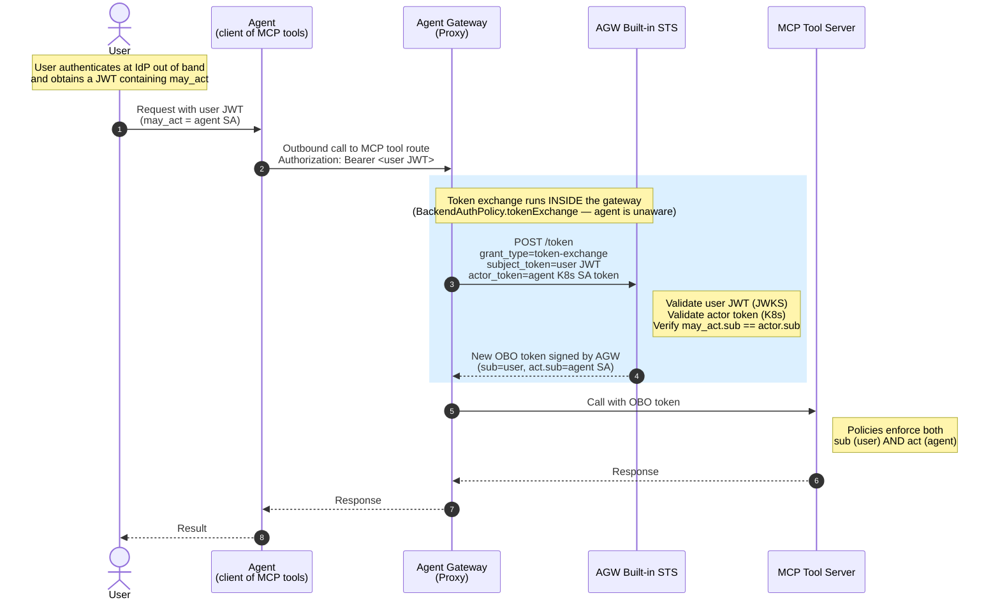

#### What the three tokens look like

OBO Delegation is the only pattern where the *input* JWT must carry a special claim — `may_act` — that the user pre-authorizes for a specific agent. There are **three** tokens in play: the user JWT, the agent's actor token, and the resulting OBO JWT.

**Input 1 — User JWT (with `may_act`)**

The user obtains this from the IdP. Critically, the IdP must be configured to mint a `may_act` claim naming the agent service account that's allowed to act on the user's behalf.

```jsonc
// Header
{
  "alg": "RS256",
  "kid": "idp-key-2026-04",
  "typ": "JWT"
}
// Payload
{
  "iss": "https://login.example.com/realms/agents",
  "sub": "u-7f0a3c91",                       // the human user
  "aud": "agent-platform",
  "exp": 1777300000,
  "iat": 1777296400,
  "email": "alice@example.com",
  "scope": "openid profile mcp:invoke",
  "may_act": {                               // KEY: pre-authorizes a specific actor
    "sub": "system:serviceaccount:agents:agent-runtime",
    "iss": "https://kubernetes.default.svc"
  }
}
```

> Without `may_act`, the STS rejects the exchange with `invalid_request`. This claim is what makes Delegation **opt-in by the user** instead of an unrestricted swap.

**Input 2 — Actor token (Kubernetes ServiceAccount JWT, projected into the agent pod)**

The agent pod mounts a projected SA token at `/var/run/secrets/tokens/...` and sends it as the `actor_token`:

```jsonc
// Payload (Kubernetes-issued)
{
  "iss": "https://kubernetes.default.svc",
  "sub": "system:serviceaccount:agents:agent-runtime",  // MUST match user JWT's may_act.sub
  "aud": ["agent-gateway-sts"],                          // audience-bound to the STS
  "exp": 1777296700,
  "iat": 1777296400,
  "kubernetes.io": {
    "namespace": "agents",
    "serviceaccount": { "name": "agent-runtime", "uid": "..." },
    "pod":            { "name": "agent-runtime-7d9c-x4f2", "uid": "..." }
  }
}
```

The STS validates this against the Kubernetes API (`TokenReview`).

**Output — OBO Token (issued by AGW STS)**

After the STS validates both inputs and confirms `may_act.sub == actor_token.sub`, it mints:

```jsonc
// Header
{
  "alg": "RS256",
  "kid": "agw-sts-key-1",
  "typ": "JWT"
}
// Payload — RFC 8693 §4.1 with full delegation chain
{
  "iss": "https://agentgateway.example.com/sts",   // CHANGED: AGW STS, not the IdP
  "sub": "u-7f0a3c91",                              // PRESERVED: the user
  "aud": "mcp-tool-server.agents.svc",              // CHANGED: scoped to the MCP tool server
  "exp": 1777296700,
  "iat": 1777296400,
  "scope": "mcp:invoke",
  "act": {                                          // NEW: full delegation chain
    "sub": "system:serviceaccount:agents:agent-runtime",
    "iss": "https://kubernetes.default.svc"
  }
}
```

What's distinctive vs. Gateway-Mediated OIDC (Variant A):

| Aspect | Gateway-Mediated OIDC (Variant A) | OBO Delegation |
|---|---|---|
| Who triggers the exchange | The **gateway**, on every backend call | The **agent** (one hop deeper in the call chain) |
| User JWT requirement | Any valid OIDC token | Must contain `may_act` |
| Who the user authenticates to | The gateway (gateway is the OAuth client) | The IdP directly (user holds the JWT) |
| Actor token | The agent's K8s SA token, but `may_act` is not required | K8s SA token + must satisfy `may_act` |
| Output `act` claim | Set to whatever actor was supplied | Cryptographically tied to a user-authorized SA |
| Trust story | "Gateway speaks for users" | "User explicitly delegated to this agent" |

> **OBO Impersonation** uses the same exchange but **without an actor token** and produces the output JWT with `sub` only (no `act`).

---

## OBO Impersonation (Token Swap) `[Enterprise]`

> **When to use:** You want downstream services to see **only the user's identity**, not the agent's, and you want to keep the original IdP token off the wire after the gateway. Cleanest for systems already designed around end-user JWTs.

Same as Delegation, but **without** an actor token. The STS validates the user JWT and issues a new JWT (signed by agentgateway) with the same `sub` and scopes — no `act` claim. Original IdP token is replaced.

### YAML — Enterprise (impersonation)

```yaml
apiVersion: enterpriseagentgateway.solo.io/v1alpha1
kind: EnterpriseAgentgatewayPolicy
metadata:
  name: obo-impersonation
  namespace: agentgateway-system
spec:
  targetRefs:
    - group: gateway.networking.k8s.io
      kind: HTTPRoute
      name: agent-route
  traffic:
    jwtAuthentication:
      mode: Strict
      providers:
        - issuer: "https://idp.example.com"
          audiences: ["agent-gateway"]
          jwks:
            remote:
              jwksPath: "/.well-known/jwks.json"
              backendRef: { kind: Service, name: idp, namespace: idp-system, port: 443 }
  backend:
    tokenExchange:
      mode: ExchangeOnly       # impersonation: no actor; STS reissues with user sub only
```

> **Trade-offs vs. Delegation:** Simpler downstream model (single identity), but loses agent attribution.

> **Docs:** [OBO Token Exchange](https://docs.solo.io/agentgateway/2.2.x/security/obo-elicitations/obo/) · [About OBO & Elicitations](https://docs.solo.io/agentgateway/2.2.x/security/obo-elicitations/about/)
> **API / Helm:** [tokenExchange Helm values](https://docs.solo.io/agentgateway/2.2.x/reference/helm/agentgateway/)

> **About this diagram.** The Mermaid version below replaces the original PNG (`images/2b-obo-impersonation.png`), which rendered the token-exchange call as `Agent → STS`. In agentgateway, the proxy is what calls the STS via `BackendAuthPolicy.tokenExchange`.

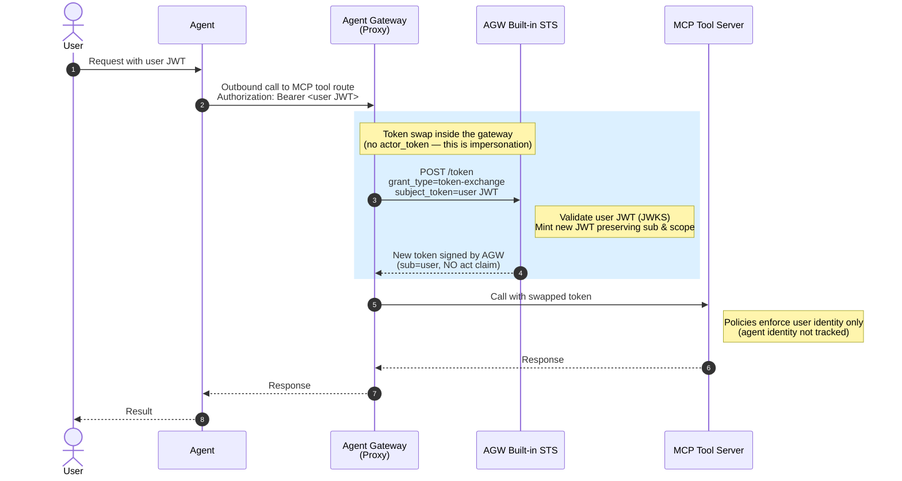

---

## Double OAuth Flow (OIDC + Elicitation) `[Enterprise]`

> **When to use:** Your agent calls a third-party API (GitHub, Atlassian, Salesforce) on behalf of the user, and that API requires its own OAuth consent — separate from your gateway's IdP. The user authenticates twice: once for the gateway, once for the upstream API.

Two sequential user-facing OAuth flows orchestrated by the gateway. First, the user authenticates via OIDC (downstream). Then, when the gateway needs to call an upstream API, it triggers an [elicitation](#elicitation-enterprise) — the user completes a second OAuth flow (upstream) via the **Solo Enterprise UI**. The STS stores the upstream token, and subsequent requests are forwarded with both the downstream JWT and the injected upstream token.

### YAML — Enterprise (downstream OIDC + upstream elicitation)

```yaml
apiVersion: v1
kind: Secret
metadata:
  name: github-oauth-app
  namespace: agentgateway-system
type: extauth.solo.io/oauth
stringData:
  client-id: <github-app-client-id>
  client-secret: <github-app-client-secret>
---
apiVersion: enterpriseagentgateway.solo.io/v1alpha1
kind: EnterpriseAgentgatewayPolicy
metadata:
  name: github-double-oauth
  namespace: agentgateway-system
spec:
  targetRefs:
    - group: gateway.networking.k8s.io
      kind: HTTPRoute
      name: github-mcp
  traffic:
    entExtAuth:                 # 1) downstream OIDC (e.g., corporate SSO)
      authConfigRef: { name: corporate-sso }
      backendRef:
        name: ext-auth-service-enterprise-agentgateway
        namespace: agentgateway-system
        port: 8083
  backend:
    tokenExchange:              # 2) upstream OAuth via elicitation
      mode: Unspecified         # Unspecified = elicit + exchange
      elicitation:
        clientName: github
        secretName: github-oauth-app
```

> **Docs:** [About OBO & Elicitations](https://docs.solo.io/agentgateway/2.2.x/security/obo-elicitations/about/) · [Elicitations](https://docs.solo.io/agentgateway/2.2.x/security/obo-elicitations/elicitations/)
> **API:** [TokenExchangeMode](https://docs.solo.io/agentgateway/2.2.x/reference/api/solo/#tokenexchangemode)

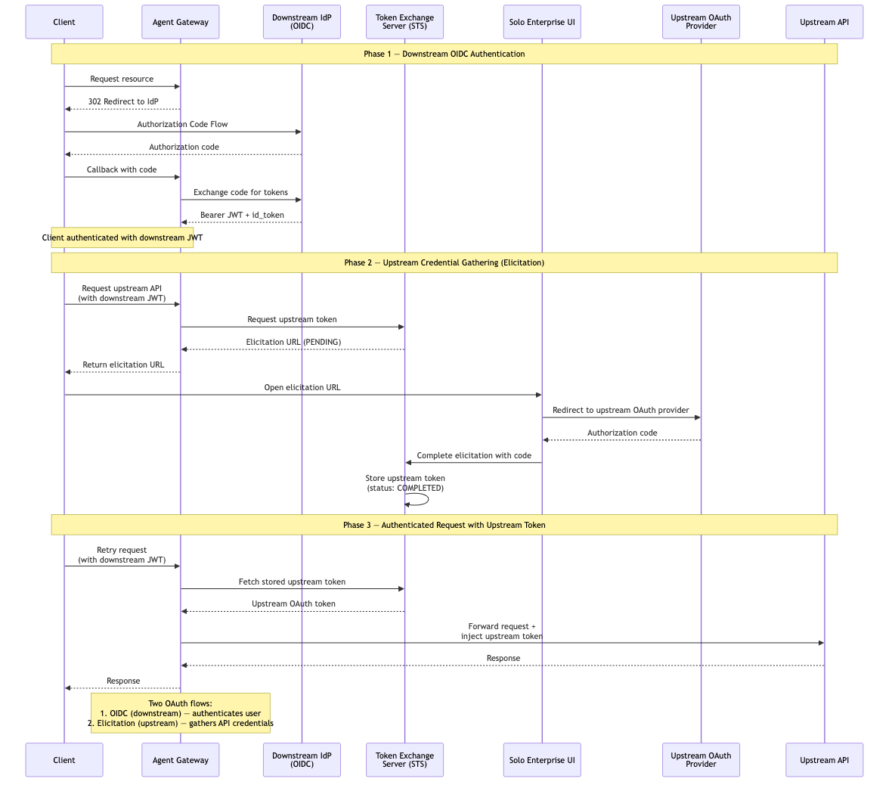

---

# Upstream / Backend Auth

Patterns for authenticating the gateway → backend hop.

---

## Passthrough Token `[OSS]`

> **When to use:** The backend is in the same identity federation as the gateway (e.g., both trust the same IdP) and you want the user's original token to reach the backend unchanged.

Inbound auth (JWT or API key) validates the client and may strip the `Authorization` header. **Passthrough** re-attaches the validated token to the outbound request so the backend receives it as-is.

### YAML — OSS

```yaml
apiVersion: agentgateway.dev/v1alpha1
kind: AgentgatewayPolicy
metadata:
  name: backend-passthrough
  namespace: agentgateway-system
spec:
  targetRefs:
    - group: ""
      kind: Service
      name: agents-backend
  backend:
    auth:
      passthrough: {}            # forward the original Authorization header
```

> **Trade-offs:** Simplest backend-auth pattern when it fits. Couples the backend to the IdP — if you ever want to decouple, you'll need [OBO](#obo-impersonation-token-swap-enterprise) or [Token Exchange](#gateway-mediated-oidc--token-exchange-enterprise).

> **Docs:** [API Keys — Passthrough Token](https://docs.solo.io/agentgateway/2.2.x/llm/api-keys/)
> **API:** [BackendAuthPassthrough (OSS)](https://docs.solo.io/agentgateway/2.2.x/reference/api/api/#backendauthpassthrough) · [BackendAuth (OSS)](https://docs.solo.io/agentgateway/2.2.x/reference/api/api/#backendauth)

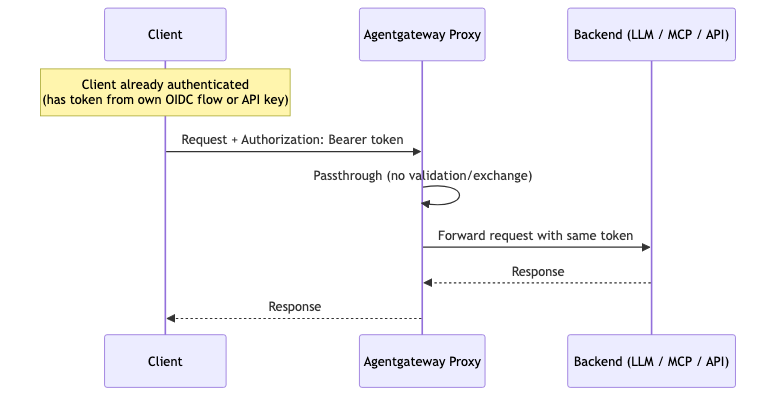

---

## Static Secret Injection (Shared Credential) `[OSS]`

> **When to use:** The backend (e.g., OpenAI, Anthropic) accepts a single API key and you want the gateway to attach it to every outbound request. The user's identity is established at the gateway via a separate inbound auth policy.

Inbound auth validates the user. A separate `backend.auth.secretRef` policy injects a static credential into the outbound `Authorization` header. **All users share the same upstream token.** For per-user upstream tokens see [Claim-Based Token Mapping](#claim-based-token-mapping-oss) or [Elicitation](#elicitation-enterprise).

### YAML — OSS (real shape from a live cluster)

```yaml
apiVersion: v1
kind: Secret
metadata:
  name: github-auth
  namespace: mcp-tools
type: Opaque
stringData:
  Authorization: "Bearer ghp_..."   # NOTE: must be stored under key "Authorization"
---
apiVersion: agentgateway.dev/v1alpha1
kind: AgentgatewayPolicy
metadata:
  name: mcp-auth
  namespace: mcp-tools
spec:
  targetRefs:
    - group: gateway.networking.k8s.io
      kind: Gateway
      name: agw-waypoint
  backend:
    auth:
      secretRef:
        name: github-auth
```

### YAML — OSS (inline `key`)

```yaml
spec:
  backend:
    auth:
      key: "Bearer sk-...redacted..."   # least-secure variant; prefer secretRef
```

> **Docs:** [API Keys — Manage API Keys](https://docs.solo.io/agentgateway/2.2.x/llm/api-keys/)
> **API:** [BackendAuth (OSS)](https://docs.solo.io/agentgateway/2.2.x/reference/api/api/#backendauth)

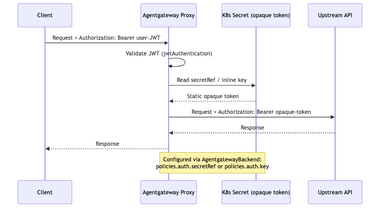

---

## Claim-Based Token Mapping `[OSS]`

> **When to use:** Different users, teams, or tiers should call the backend with **different** upstream credentials (e.g., free vs. paid OpenAI keys; per-team Anthropic keys). You don't need user OAuth — a static map keyed by JWT claim is enough.

Validate the inbound JWT, then use a CEL request transformation to set the `Authorization` header based on a JWT claim (`sub`, `team`, `tier`, etc.).

> **OSS validation:** `TrafficPolicySpec.transformation.request.set` exists in the OSS proto and accepts CEL expressions. Combined with OSS `jwtAuthentication`, the full pattern runs on the OSS data plane. The original workshop demo uses `EnterpriseAgentgatewayPolicy` because Enterprise CRDs are the standard control-plane surface on Kubernetes.

### YAML — OSS (JWT claim → Authorization header via CEL)

```yaml
apiVersion: agentgateway.dev/v1alpha1
kind: AgentgatewayPolicy
metadata:
  name: claim-based-mapping
  namespace: agentgateway-system
spec:
  targetRefs:
    - group: gateway.networking.k8s.io
      kind: HTTPRoute
      name: openai-route
  traffic:
    jwtAuthentication:
      mode: Strict
      providers:
        - issuer: "https://idp.example.com"
          audiences: [agent-gateway]
          jwks:
            remote:
              jwksPath: "/.well-known/jwks.json"
              backendRef: { kind: Service, name: idp, namespace: idp-system, port: 443 }
    transformation:
      request:
        set:
          # Pick a key based on the user's `tier` claim.
          # `vault.lookup` here is a placeholder for whichever CEL function or
          # static map your build exposes — substitute a `has(jwt.tier) && jwt.tier == "..."`
          # ternary if you prefer pure CEL.
          - name: Authorization
            expression: |
              "Bearer " + (
                jwt.tier == "paid" ? "<paid-tier-key>" :
                jwt.tier == "internal" ? "<internal-key>" :
                "<free-tier-key>"
              )
```

> **Docs:** [CEL Transformations](https://docs.solo.io/agentgateway/2.2.x/traffic-management/transformations/) · [JWT Auth for MCP Services](https://docs.solo.io/agentgateway/2.2.x/mcp/mcp-access/)
> **API:** [TransformationPolicy (OSS)](https://docs.solo.io/agentgateway/2.2.x/reference/api/api/#transformationpolicy) · [EnterpriseAgentgatewayBackendPolicy](https://docs.solo.io/agentgateway/2.2.x/reference/api/solo/#enterpriseagentgatewaybackendpolicy)


---

# Credential Gathering

---

## Elicitation `[Enterprise]`

> **When to use:** The agent occasionally needs to call upstream APIs (GitHub, Atlassian, Google Workspace) on behalf of the user, and you need real user consent for each provider. Triggers a one-time per-user OAuth flow when needed; subsequent requests reuse the stored token.

When a request needs an upstream OAuth token but none is available yet, the gateway returns the **elicitation URL** to the client with a `PENDING` status. The user opens that URL in the **Solo Enterprise UI** to complete the upstream OAuth flow. Once `COMPLETED`, the client retries the original request and the gateway injects the stored token.

> **Why Enterprise:** Requires the Solo Enterprise UI to host the consent flow and the Enterprise control plane to durably store per-user upstream tokens. The `tokenExchange.elicitation` field is in the Enterprise proto only.

### YAML — Enterprise (elicit-only mode)

```yaml
apiVersion: v1
kind: Secret
metadata:
  name: jira-oauth-app
  namespace: agentgateway-system
type: extauth.solo.io/oauth
stringData:
  client-id: <jira-app-client-id>
  client-secret: <jira-app-client-secret>
---
apiVersion: enterpriseagentgateway.solo.io/v1alpha1
kind: EnterpriseAgentgatewayPolicy
metadata:
  name: jira-elicit-only
  namespace: agentgateway-system
spec:
  targetRefs:
    - group: gateway.networking.k8s.io
      kind: HTTPRoute
      name: jira-mcp
  backend:
    tokenExchange:
      mode: ElicitOnly         # do not exchange, only gather upstream creds
      elicitation:
        clientName: jira
        secretName: jira-oauth-app
```

> **Docs:** [Elicitations](https://docs.solo.io/agentgateway/2.2.x/security/obo-elicitations/elicitations/) · [About OBO & Elicitations](https://docs.solo.io/agentgateway/2.2.x/security/obo-elicitations/about/)
> **API:** [TokenExchangeMode](https://docs.solo.io/agentgateway/2.2.x/reference/api/solo/#tokenexchangemode)

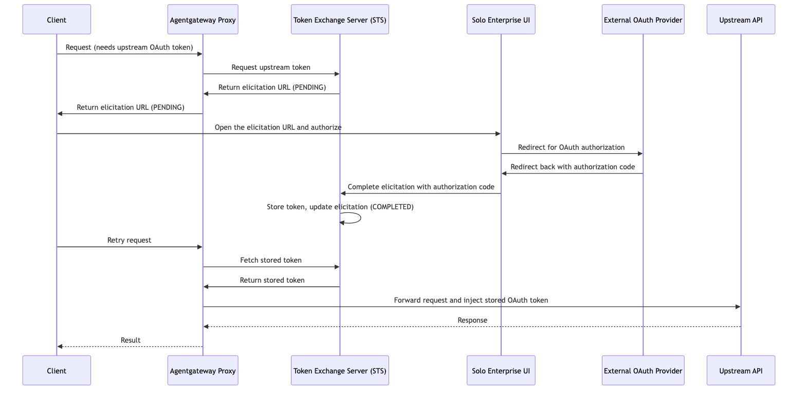

---

# Decision Flowchart

## How Should This Request Be Authenticated?

> **Docs:** [Security Overview](https://docs.solo.io/agentgateway/2.2.x/security/) · [OBO & Elicitations](https://docs.solo.io/agentgateway/2.2.x/security/obo-elicitations/) · [External Auth](https://docs.solo.io/agentgateway/2.2.x/security/extauth/) · [MCP Auth](https://docs.solo.io/agentgateway/2.2.x/mcp/auth/about/)
> **API:** [Enterprise API Reference](https://docs.solo.io/agentgateway/2.2.x/reference/api/solo/)

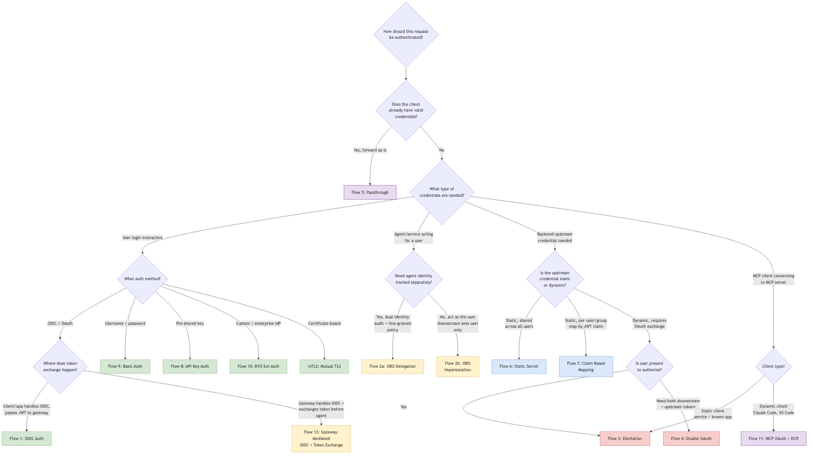

---

# Glossary

| Term | Meaning |
|---|---|
| **`act` claim** | An RFC 8693 JWT claim identifying the actor (the agent/service) acting on behalf of the subject. Paired with `sub`. |
| **AuthConfig** | Solo Enterprise CRD (`extauth.solo.io/v1`) describing an external auth flow (OIDC, OAuth2, API key, OPA, etc.) consumed by the Enterprise external auth service. Used by `entExtAuth`. |
| **DCR** | Dynamic Client Registration (RFC 7591). Lets OAuth clients register themselves with an authorization server at runtime instead of via human onboarding. |
| **`entExtAuth`** | Enterprise field on `EnterpriseAgentgatewayPolicy.traffic` that delegates auth to the Solo Enterprise external auth service via an `AuthConfig`. |
| **`extAuth`** | OSS field on `AgentgatewayPolicy.traffic` that delegates to a user-supplied gRPC or HTTP service via the Envoy `ext_authz` protocol. |
| **Elicitation** | An agentgateway flow that prompts a user to complete an upstream OAuth authorization out-of-band (in the Solo UI) so the gateway can inject the resulting token on later requests. Enterprise-only. |
| **JWKS** | JSON Web Key Set — the public keys an IdP publishes (typically at `/.well-known/jwks.json`) so receivers can verify JWT signatures. |
| **`may_act` claim** | A JWT claim a user issues authorizing a specific actor (agent) to call services on their behalf. Required by [OBO Delegation](#obo-delegation-dual-identity-enterprise). |
| **MCP** | Model Context Protocol — an open protocol for connecting LLM clients to tool-providing servers. |
| **OBO** | On-Behalf-Of. A pattern (typically via RFC 8693 or Microsoft's `jwt-bearer` grant) where one service exchanges a user token for a token scoped to a downstream resource. |
| **OIDC** | OpenID Connect. An authentication layer on top of OAuth 2.0 that produces an `id_token` (JWT) describing the user. |
| **RFC 7617** | The HTTP Basic Authentication scheme. |
| **RFC 8693** | The OAuth 2.0 Token Exchange spec — the standard for swapping one token for another. |
| **STS** | Security Token Service. The component that issues new tokens during exchange. agentgateway has a built-in STS for OBO flows; Entra ID can act as an external STS. Enterprise-only. |
| **`sub` claim** | The standard JWT claim identifying the subject (user or principal) the token is about. |

---

## Appendix: How Each Pattern Was Validated

| Pattern | Validation source |
|---|---|
| API Key Auth | OSS proto `TrafficPolicySpec.APIKey` + Enterprise `AuthConfig.apiKeyAuth` use-case |
| Basic Auth | OSS proto `TrafficPolicySpec.BasicAuthentication` |
| BYO External Auth | OSS proto `TrafficPolicySpec.ExternalAuth` (`ext_authz`); live cluster `agentgatewaypolicy/jwt-test` uses `extAuth` |
| Standard OIDC / JWT | OSS proto `TrafficPolicySpec.JWT`; live cluster `agentgatewaypolicy/jwt-test` |
| Mutual TLS | OSS proto `BackendTLS`; OSS Gateway-API `BackendTLSPolicy`; standalone example `examples/tls/config.yaml` |
| MCP OAuth + DCR | OSS proto `BackendPolicySpec.McpAuthentication` (with `McpIDP::Keycloak`/`Auth0`); standalone example `examples/mcp-authentication/config.yaml` |
| Passthrough Token | OSS proto `BackendAuthPolicy.Passthrough` |
| Static Secret Injection | OSS proto `BackendAuthPolicy.Key`/`secretRef`; live cluster `agentgatewaypolicy/mcp-auth` |
| Claim-Based Token Mapping | OSS proto `TransformationPolicy` + `JWT` |
| Gateway-Mediated OIDC + Token Exchange | Enterprise proto `BackendAuthPolicy.token_exchange` (Enterprise-only) |
| OBO Delegation | Enterprise proto `TokenExchange` + `may_act` claim plumbing |
| OBO Impersonation | Enterprise proto `TokenExchange` (`EXCHANGE_ONLY`) |
| Double OAuth Flow | Enterprise proto `TokenExchange` (default) + `elicitation` field |
| Elicitation | Enterprise proto `TokenExchange` (`ELICIT_ONLY`) + Solo Enterprise UI |
