# Agent Auth Patterns — Session Transcript

*A walkthrough of the authentication and authorization patterns that matter for AI agents and MCP, presented by **Ram Vennam** and **Cory Jett**. Lightly edited from the recording for readability — filler removed, terms corrected — with the session diagrams embedded. Runtime ~1 hour.*

---

## Why this talk

**Ram:** At Solo we've been an API gateway and service mesh company since the beginning, and authentication and authorization have always been a key part of what our products deliver. But up until now, the patterns for how clients authenticate against your server or gateway have been relatively straightforward. Our users and prospects understand what they're trying to accomplish, at least at a high level — so it's been more of "here are the features we have, do they meet your requirements?" Most of the time they do, you check the box and move on.

With agentic patterns, we now have new types of clients. Not just browsers or a CLI, but IDEs doing their own flows, AI clients like Claude and Cursor, and agents themselves performing authentication flows. The patterns are changing. What we're noticing is that with a lot of prospects and customers, we spend several meetings talking about *just* authentication and authorization — they have multiple clients, each wants to authenticate in a different way, and they're trying to reach destinations that have their own identity.

So the whole concept of authentication and authorization is resurfacing, and new patterns are emerging: token exchange, elicitation, on-behalf-of. These are all new words for a lot of folks. The point of today's talk is to simplify some of these down. It's still technical, but I want to focus on the *why* rather than exactly *how* it's implemented — because that lets us have better conversations with prospects. A lot of the time prospects don't know what they're trying to accomplish; they're looking for a subject-matter expert to guide the way.

**Cory:** That last part is key. All of this is new, it's evolving quickly, and it's rocket science to a lot of people — poorly understood unless you specialize in it, but highly applicable to the work we do. These conversations come up in every single opportunity I've been a part of. It's key for agentgateway, for kagent, for Agent Registry. There are near-infinite permutations of how you can do these things, so understanding the core flows and concepts — and being able to intelligently guide a prospect through them — is a competitive advantage for us. Being a trusted advisor through these conversations is going to put us well ahead of our competition.

**Ram:** Exactly. We only have an hour, so we're not doing a deep dive into every pattern. The point is that you know what patterns are available, so you can have the conversation — or ask Claude intelligent questions — and then go figure out the exact implementation later.

The core patterns break into **inbound** and **outbound**. Inbound is traffic coming into agentgateway from the clients, and how we authenticate that. Outbound is agentgateway reaching out to whatever destination the client wants, and the authentication patterns we have there. Then we'll talk about how you build hybrid flows that combine different inbound and outbound patterns.

---

## JWT: the foundation

**Ram:** At the core, what we're solving is: a client — a browser, Cursor, whatever — is trying to reach a destination, and that destination needs to know *who are you* and *what are you allowed to do*. There are multiple ways an application can figure that out, but the industry standard is to use a **JWT** to transport those credentials from the client to the application.

A JWT is just a standard way to encode a set of information into a token and pass it to somebody, where that somebody can decode it and verify the token was created by someone they trust. It's a secure way to transport information. In this context, it carries identity and authorization: who you are, and what you're allowed to do.

If you decode a JWT, the parts we care about here are the **subject** — who this is, so in this case the subject is Alice — the **issuer**, so the destination can go verify it, and the **claims** (groups, etc.) that define what this person is allowed to do. There's other information in there like the expiration, but the payload — the claims — is the piece that matters most.

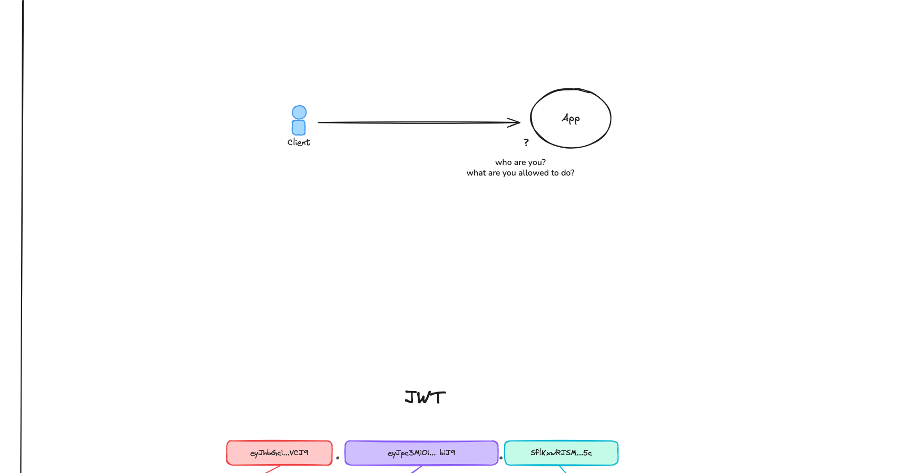

So how does a user get a JWT? Fundamentally there's an **IdP** — think Auth0, Entra, and so on. Anywhere you log in with a user ID and password, what you get back under the covers is a JWT. That token identifies the user. The user takes that token and calls the app. The app gets the token, sees from the issuer who issued it, validates it against the IdP if it trusts it, decodes it, and now it knows everything about the user.

But you don't want every single app to carry the logic to decode and verify tokens — your tokens can change, your issuer can change, and having that logic in thousands of applications doesn't make sense. So you put agentgateway (or some gateway) in front of your application. The gateway does the validation: a user comes in, the gateway decodes the JWT, extracts the claims, applies any policies, puts the claims into headers, and forwards the request to the app. As long as the app is only reachable through agentgateway — which is typical when the app sits inside a Kubernetes cluster with the gateway at the edge — the app no longer has to do any verification itself. It's a trusted path.

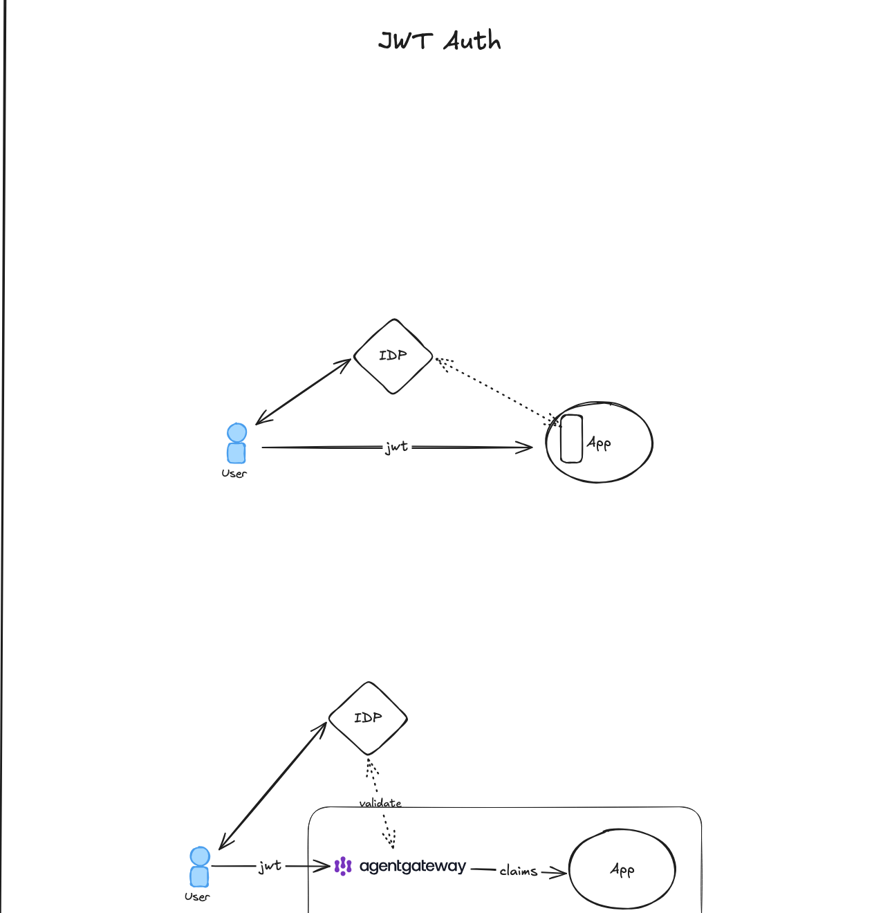

Those are the basics. Now let's build on them.

**Stephen (audience):** Just to verify — the IdP is where the policy and the JWT are defined, or stored? It's a database of all this information about who somebody is and what they can access?

**Ram:** Right. If you give the IdP your username and password, the IdP knows who you are — so yes, it's like a database of all the users and what they're allowed to do. The JWT part is created on the fly: when you log in, the IdP mints the token, with things like the expiration baked into it. Tokens typically last an hour or a day, and all of that lives in the token itself. So the IdP doesn't have to store the token afterward — it writes the token, hands it to the user, and the user can do what they want with it.

---

## OIDC and OAuth

**Cory:** Let's go from the basics straight into the weeds and talk about OIDC and OAuth. These build on the JWT concepts Ram just walked through — the structure of an OIDC JWT with its claims and expiry.

The intent of OAuth and OIDC is for a user to authenticate to an application *without sharing their password with that application*. **OIDC is an extension of OAuth that adds authentication** — identity — on top of OAuth's authorization. The point of splitting it into two pieces is captured by the hotel analogy I've used with prospects: anybody can go to the front desk with a driver's license or government-issued ID that says who you are — that doesn't say what you can do, it just identifies you. OAuth is the equivalent of the key card you get for your room: it has access to a specific room, maybe the gym, maybe the continental breakfast, but not other people's rooms and not the club on the top floor. It's limited access.

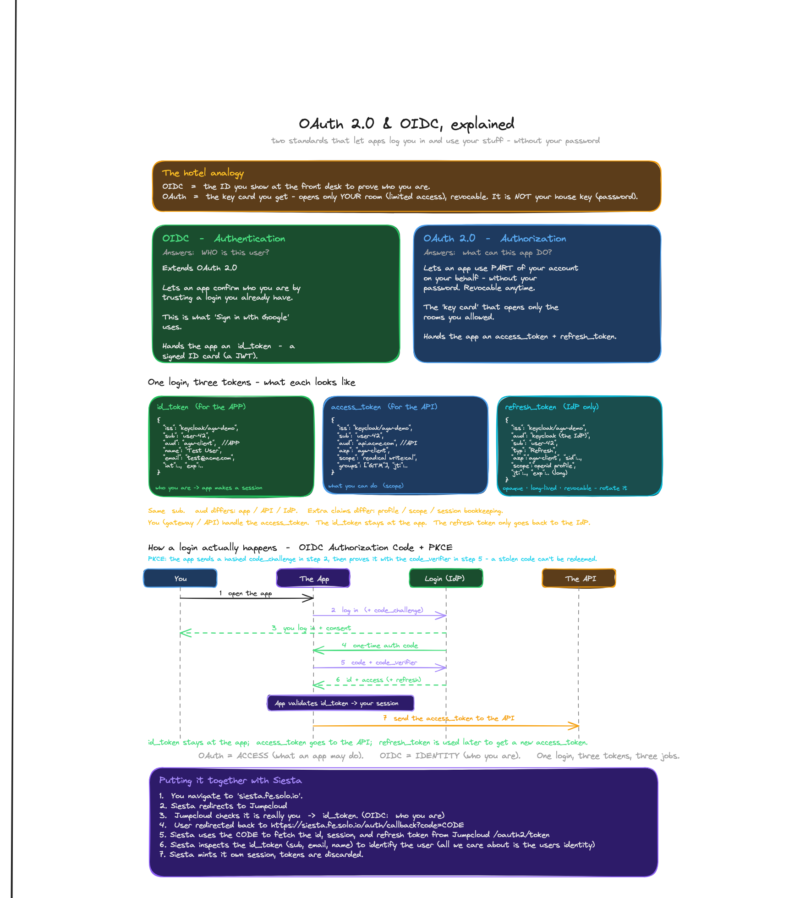

**OIDC** is where you identify yourself to an application — it lets the app confirm who you are and build an experience specific to you. It identifies you as a user and maps you to a session (your context within the app: your configuration, history, and so on), so you don't overlap with another user when they log in.

**OAuth** is the part with scopes and groups, where the application can look at the token and see what it's allowed to do for a specific **audience** — the actual endpoint or service the token is intended for.

A single login manifests as **three tokens**:

- **ID token** — who you are (OIDC). It's consumed by the application, so it has to be a JWT the app can read and break apart.
- **Access token** — what the app can do on your behalf (OAuth). Short-lived — good for minutes or hours — and used frequently, on every API call.
- **Refresh token** — used far less often, only to fetch a new access token, so it lives longer. It's typically opaque (a random string) since only the IdP reads it. Splitting them this way limits the exposure of the long-lived credential.

The one consistent thing across all three is the subject — the user.

Now, what actually happens when you log in: you open an application — say, Siesta. It has configuration that says which IdP to use for OIDC login, so it redirects you there — in this case Keycloak. There's also **PKCE** ("pixie"), which adds another layer of security; you'll see prospects with PKCE enabled and a little extra configuration. You're redirected to Keycloak, you log in or consent, and the IdP sends an authorization code back to the application. The app exchanges that code (plus a PKCE code verifier) and, assuming everything checks out, the IdP returns the ID, access, and refresh tokens.

Notice you never give the application your password — that's the whole point. The app validates your ID token, maps you to a session, and can use the access token to reach downstream APIs.

**Ram:** Let me pause — I know this is a lot of information, but this is the underpinning for a lot of what we do from an agentgateway perspective. agentgateway doesn't ship with its own IdP; it relies on some way to identify a user, and the best way for an enterprise to do that is with the IdP they already have. So if they're using Okta, ForgeRock, Entra, Keycloak, Ping Identity — this is the integration that makes it work.

---

## Gateway-mediated OIDC (the login dance)

**Ram:** Building on that: your app needs the JWT, similar to before. When we logged in, we authenticated with the IdP, got the JWT, and send it with the request.

But what if the user is hitting the app for the very first time and doesn't have a JWT? They don't know where to go authenticate. In the previous flow, the user already knew where the IdP was, logged in, and came back with the JWT — but that's not the typical browser flow. In a browser you hit the application directly, and you need to be *told* to go log in with an IdP and come back with a credential.

agentgateway itself can do the **OIDC login dance** — this is usually called *gateway-mediated OIDC*. When the user hits your app through agentgateway and there's no session token or JWT, the gateway sees the app is configured with an OIDC login flow and uses the enterprise external-auth service to redirect the user to the IdP. The user logs in, and through a back-and-forth, agentgateway gets the user's JWT (plus a refresh token to keep it up to date) and sends the user back a **session cookie**.

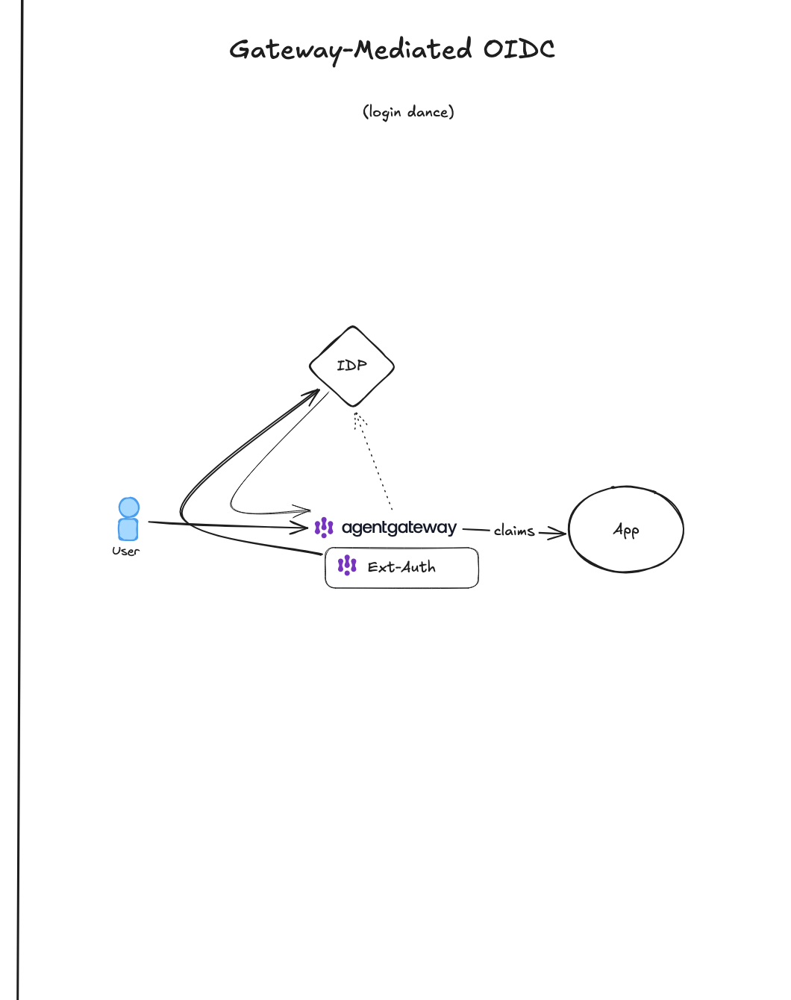

On subsequent requests, the user comes back with that session cookie, the gateway maps it to a JWT, and does the same claims-based routing to your destinations. This is a standard way to protect applications — we've been doing it with Gloo Edge, kgateway, and so on for a long time. It's very common for browsers and traditional web applications.

---

## External auth (ext_authz and ext_proc)

**Cory:** This is a bit of an aside, but it's something you'll see out in the field — I saw it just this week, which is why Cedar is referenced at the top.

agentgateway (and kgateway and Gloo Gateway before it, all built on Envoy) has two extension points: **ext_authz** and **ext_proc**. These let you build services *outside* the gateway to do things the gateway can't do inherently. A common use case is an organization wanting to use their own **PDP** — policy decision point — alongside the gateway: an external system that gives a thumbs-up or thumbs-down on whether a request or response can proceed, based on information in that request or response.

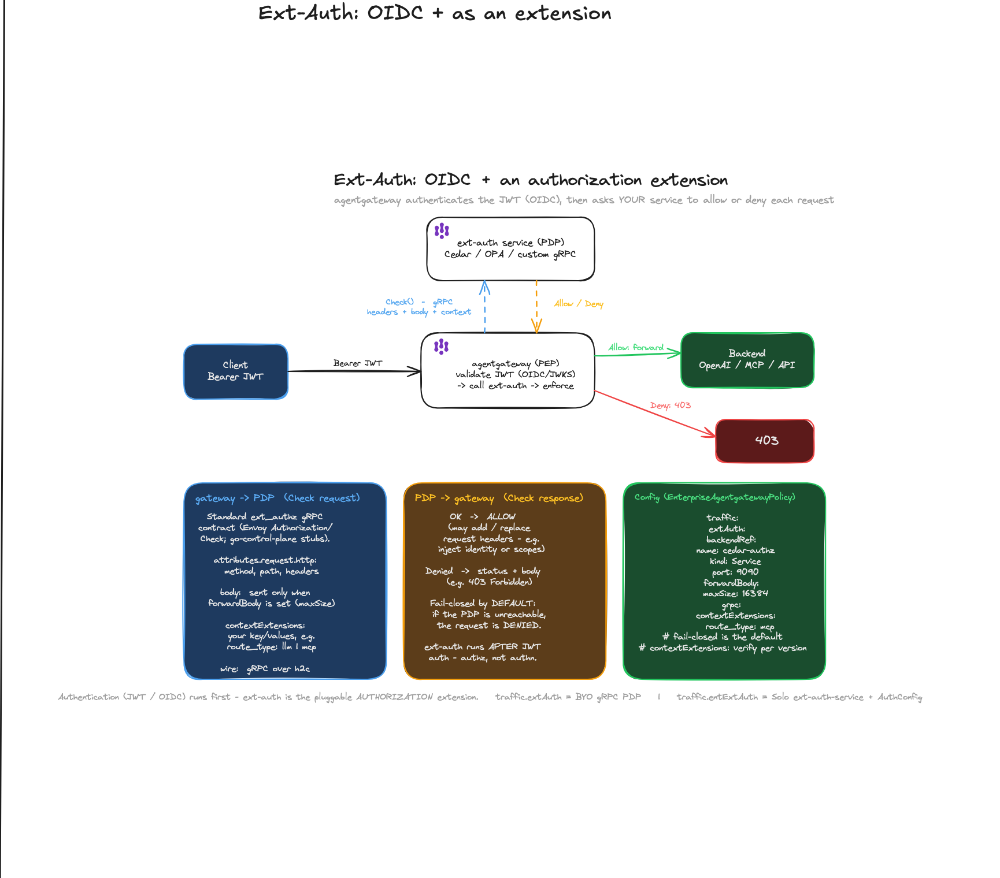

So you can have a flow where a user hits a backend — OpenAI, an LLM, an MCP server, an API — through a standard OIDC flow with a JWT. agentgateway validates the JWT and then calls an external auth endpoint to make a decision. Maybe it's not based on the user's identity at all, but on information in the request itself.

You can send that external endpoint the method, path, headers — even the body. That last part is where it gets interesting for LLMs and MCP, because almost all of the actionable data is in the body, not in HTTP metadata. It's sent over gRPC using the Envoy authorization-check interface, which we've adapted to agentgateway. The backend service looks at the data, runs it through whatever logic it wants, and returns allow or deny — and it can also modify the request (adding headers, identities, scopes, or scrubbing PII, though that's more specific to ext_proc). There's also configuration for the fail state: if the external service is unavailable, do you fail open (let traffic through) or fail closed (deny it)? That depends on how mission-critical the integration is.

**Ram:** The one key takeaway: the authorization decision — whether you're allowed to do something — doesn't have to live entirely in the JWT. This is an extension mechanism where you can build your own logic, or call your own database, using information from the JWT, the headers, the body, and so on, to make custom decisions.

---

## Dynamic Client Registration (and Fake DCR)

**Ram:** Getting deeper into the weeds — as much as we tried to avoid it — is **Dynamic Client Registration**.

With normal browser applications, *you* are the client. There's essentially one client, and you go through a gateway to reach your resource. With AI, it's not always the user directly reaching the destination. The user works through clients — Claude, Cursor, VS Code, another agent — that act on their behalf. That means the client itself is now the OAuth client. Each of those clients does the entire flow and has its own JWT. This client might be allowed to talk to one MCP server, that client only to another. So you have multiple clients that each need to be identified, each with access to different MCP endpoints.

There's a new OAuth spec for letting these clients register in your IdP so the IdP knows exactly which client is making a request — and so you can do things like revoke one specific client. **DCR (RFC 7591)** adds a registration endpoint to your IdP that lets clients self-register. That's needed because every user will have lots of clients; you can't manually register each one. Without DCR, you have to manually pre-register each client. With DCR, a client calls a `/register` endpoint, registers itself, and completes the OAuth flow. Then it kicks back to the user, the user logs in — so you have the human identity — and the client uses that to reach its destination.

This is great in theory, but most of the common IdPs — Entra, for example — don't support dynamic client registration. So each client can't automatically register itself just by calling an endpoint. If you want that functionality, where each client is a unique OAuth client, you need to **build your own custom authorization server**. We have one of these for all the MCP servers at Solo — `auth-mcp.solo.io` — where you can log in and see all your registered MCP clients. When a client registers, each one gets its own client ID, so we can uniquely identify it. Once the user logs into the IdP, the authorization server brokers the login and keeps a map of its own issued token to the IdP token. That's the registration path; the normal data path is where you show up with the JWT and agentgateway enforces it to the MCP.

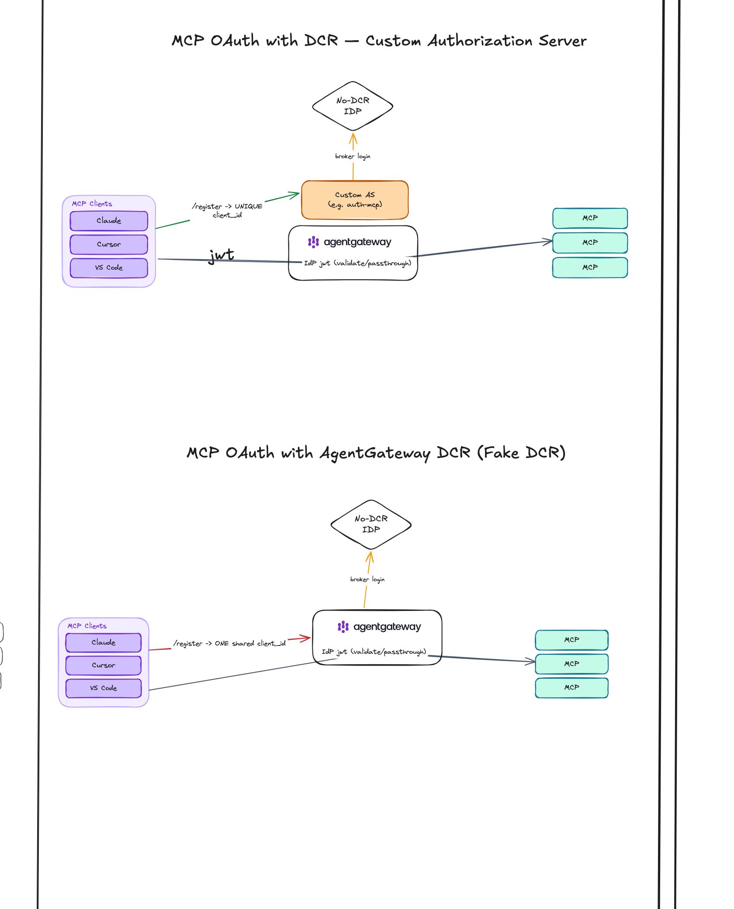

If you *don't* want to build your own custom authorization server, but you're using an IdP that doesn't support DCR, agentgateway has a feature to do the dynamic client registration for you. agentgateway itself acts as the authorization server and provides the `/register` endpoint — that's **Fake DCR**.

The big downside: there's now only one client. When agentgateway replies to `/register`, it uses the one shared client ID it registered for itself, and hands that same client ID back to every client. This lets each client complete the DCR flow — when you register an MCP endpoint, it goes back to the user, the user logs in, so we know who the user is — but because they all share the same client ID, we can't uniquely distinguish the different clients. There's a trade-off, but for most users it's worth it: you get to use agentgateway as both your authorization server and the proxy to your MCP destinations, without building an authorization server yourself.

I greatly simplified a lot here and glossed over details, but hopefully the pattern is useful. That covers the main inbound patterns — all the ways agentgateway can identify who you are and what you're allowed to do.

---

## Outbound: Passthrough Token

**Ram:** The next set of patterns is **outbound**: once we know who you are, what can agentgateway do when it reaches a destination — an LLM, an agent, and so on? These are meant to be used together with the inbound patterns.

The simplest is **passthrough token**. If the user comes in with a JWT — or if agentgateway went and got the JWT on the user's behalf as an OAuth client — it can simply validate the JWT, read any claims, apply any of the extensions we talked about, and then, when it calls the destination, inject the JWT as an `Authorization: Bearer` header and send it on.

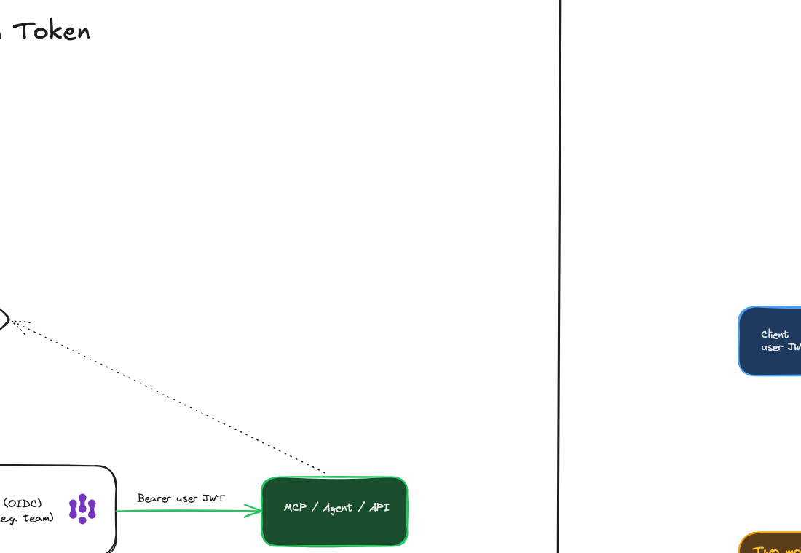

That's the simplest one. It's useful when your final destination knows the identity provider of that JWT and does its own validation — so if you're using remote MCPs, this is very handy.

---

## Outbound: Static Secret Injection and Claim-Based Mapping

**Cory:** Building on that is **static secret injection** — the next evolution. Here the gateway validates the user's JWT (or some identifier), then swaps it for a backend credential before calling the upstream. The user's token never reaches the backend — and, just as importantly, sometimes the user never sees the backend credential. From an agentgateway perspective this is commonly used for things like **virtual keys** for OpenAI or other LLM providers, where you don't want to share a key: you identify a user, then transparently swap in the credential on the backend.

There are two common modes:

- **Shared** — one secret for every authenticated user. Everyone gets the same OpenAI key on the backend.
- **Per-claim** — you look at the JWT (or the identifier, or a header), pick a secret based on a claim, and say "I get one OpenAI key, Ram gets another."

Either way, the backend never sees the source token. This is also good for legacy APIs that can't do per-user authorization — now the gateway becomes the trust boundary and swaps in the appropriate backend credential.

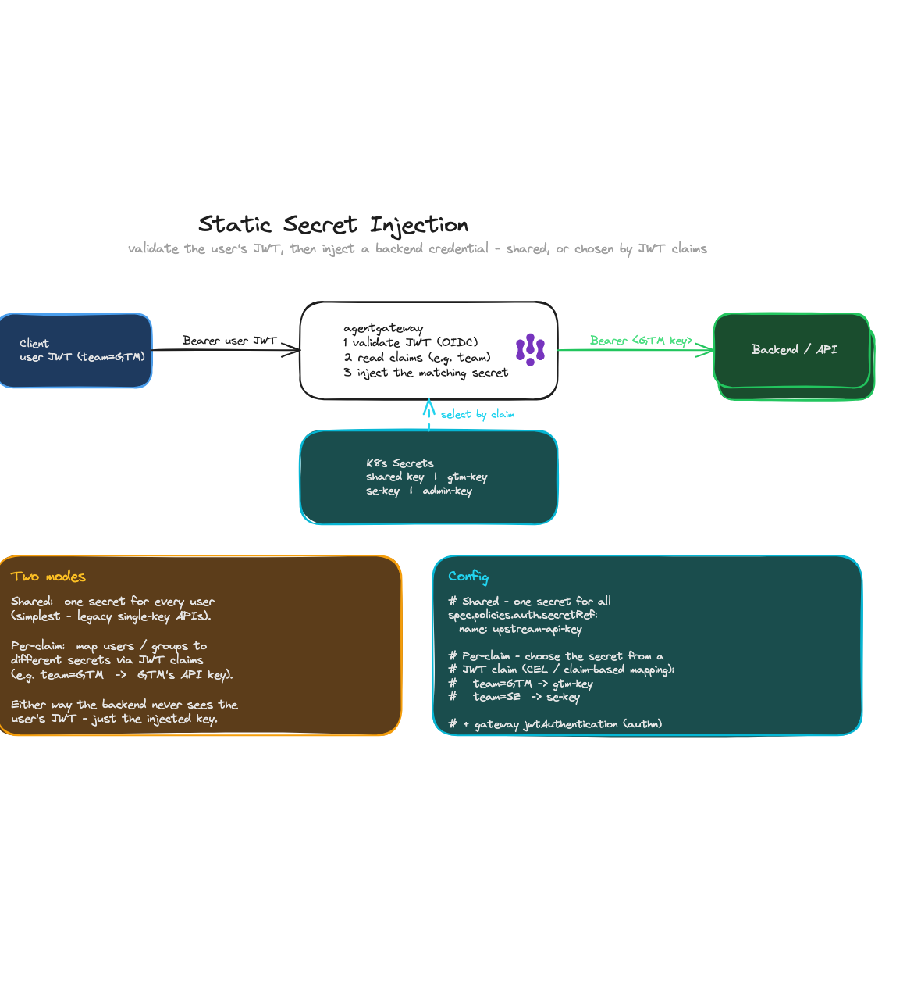

**Ram:** Keep in mind this is all one identity domain. Your corporation might use Entra, so you log in to agentgateway with Entra, and then agentgateway exchanges that Entra token for whatever the destination needs — an API key, say — injects it, and calls the destination.

**Cory:** This next piece overlaps a little. A key comes in — you can use Kubernetes secrets or other stores for the key you're swapping in — we validate what's coming in, swap it out, and forward to the backend. And we can use CEL, the Common Expression Language, to break apart a JWT, look at specific information, and map it. If you're using a shared agentgateway instance to reach LLMs like Anthropic, OpenAI, or Vertex, it's similar: agentgateway looks at your credentials and maps you to the appropriate backend.

---

## Token exchange (RFC 8693)

**Ram:** Next, **token exchange** — especially important for agentic use cases. Christian Posta writes about this a lot. Let's cover *why* you need it.

In an agentic workflow, a user talks to one app, which talks to an agent, which talks to another agent — multi-hop workflows that happen whenever you ask an AI-powered app to do something. The very first authentication was you logging in with your IdP, and you have a **broad token** that identifies who you are and everything you're allowed to do. It might say you're in the engineering organization, you're allowed to call MCP, and you're also a GCP admin.

If you blindly pass that token to Agent 1, and Agent 1 passes it to Agent 2, you're giving each agent your token — it's essentially acting as *you*, with full credentials, anywhere in your identity domain, until the token expires. You don't want that: one of these agents could be compromised or could mishandle the token. So you need to **exchange** this token for another one.

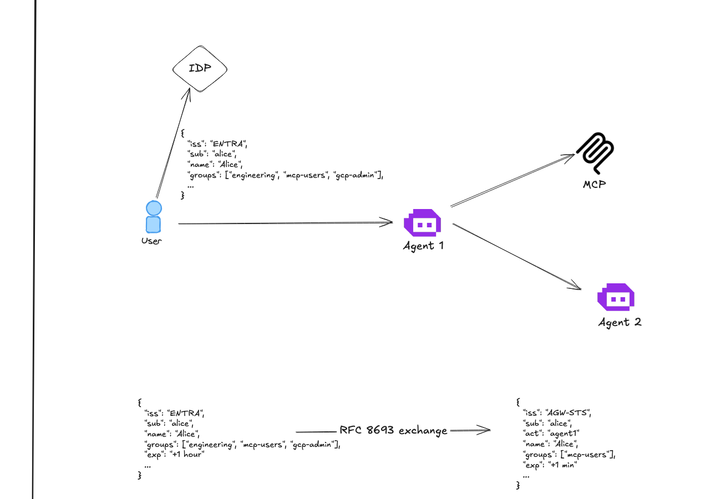

The whole concept falls under **RFC 8693**. The simplest exchange changes the issuer — the token issuer service creates a new issuer, which could be itself. It keeps the subject, but can add things (like an **actor**, saying the original user is Alice but Agent 1 is acting on her behalf) or remove things — we can trim the groups down (there's no reason for this token to say GCP admin if what we're doing has nothing to do with GCP) and trim the expiration, so the token is only valid for a minute. That, at a high level, is what a token exchange is and why you need it: scope it down, change the issuer.

**Cory:** I'll keep this short. This is what Ram just described: user credentials come into the gateway, the gateway does an RFC 8693 exchange — in this case with the token-exchange service built into agentgateway, though it doesn't have to be that endpoint. You have a user token issued by Keycloak with a subject (Alice) and an audience. In the exchanged token, the issuer has changed — now it was issued by agentgateway. The subject is the same (a user is a user, front end or back end), but the audience has changed and is scoped for the actual backend, in this case an MCP backend. And there's no `act` claim — which leads into what Ram covers next.

**Ram:** Right. The user logged in with their corporate IdP and got a JWT, but agentgateway exchanged it for its own STS-issued token. Now the backend never sees the original JWT and doesn't need to validate against the IdP — it validates against the STS.

---

## Delegation (on-behalf-of)

**Ram:** What we just covered is a **token swap** (impersonation). When the destination gets the token, it still says the subject is Alice — it represents the user, and the action is done on the user's behalf, so to everyone it looks like the user did it. But the token being used is scoped down, with a smaller identity domain — it's more secure, even though it still looks like the user performing the action.

We can do something better: an **on-behalf-of** token, where we embed the **actor**. We maintain the original user, but also say this token is currently scoped only for Agent 2 to perform an action, and it came from Agent 1 — so we maintain a chain of agents as well as the original user. That's **delegation**.

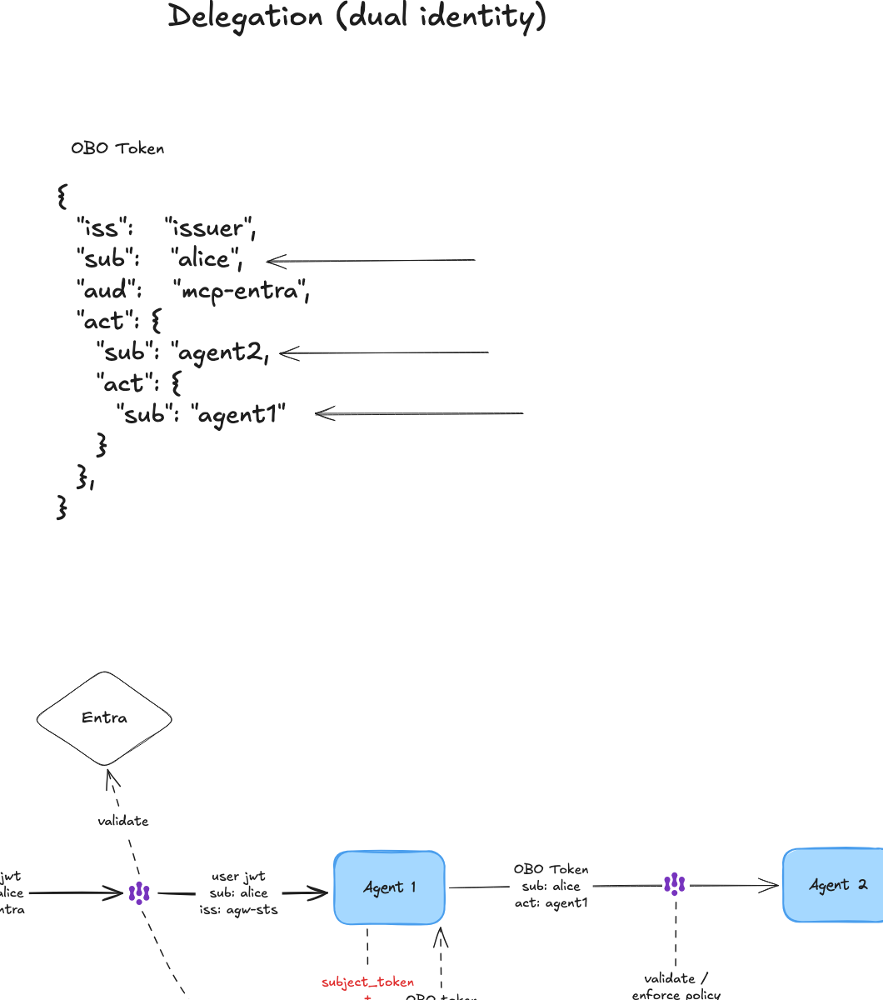

Now put the two concepts together. A user talks to Agent 1, which talks to Agent 2. The user logs in with their corporate IdP and gets a broad token. agentgateway sits at the front and does **impersonation** — the token exchange we covered — to get a scoped-down token, and uses that to talk to Agent 1. Agent 1 does its work, then exchanges with the same STS to get an **on-behalf-of** token, because it's now acting on behalf of the user. That new token maintains the chain: the subject is Alice, but the actor is Agent 1. Then it calls Agent 2.

agentgateway sits in the middle and can validate and enforce that this agent is allowed to talk to that agent, because now we have the full chain. So you can write policy in agentgateway that says: Alice is allowed to talk to Agent 2 — but really, Agent 1 is allowed to talk to Agent 2 *when it's acting on behalf of Alice, who has these claims*. You can write very rich, fine-grained authorization on who's allowed to talk to what.

I'm sure there are a ton of questions here, but for the sake of time let's move on — write them down and we can do follow-up sessions where I drill in and be more technically precise.

---

## Elicitation (eager vs lazy)

**Ram:** Let's switch gears and talk about **elicitation**.

When a user uses their client — their AI agent, Claude, etc. — to perform an operation, that client has access to multiple MCP servers. If you use Claude, you've probably added a few: we have some at Solo, and you might be using the GitHub MCP server, the Snowflake MCP server, and so on. Every one of these MCP servers does downstream operations and is protected in its own identity domain, with its own OAuth authentication and authorization. This OAuth is different from that OAuth, which is different from the next OAuth flow.

So when Claude performs actions that span multiple MCPs, it triggers back to you: "you're trying to do something with GitHub, but you're not logged in yet." You need to go **elicit** that — get the OAuth tokens for GitHub.

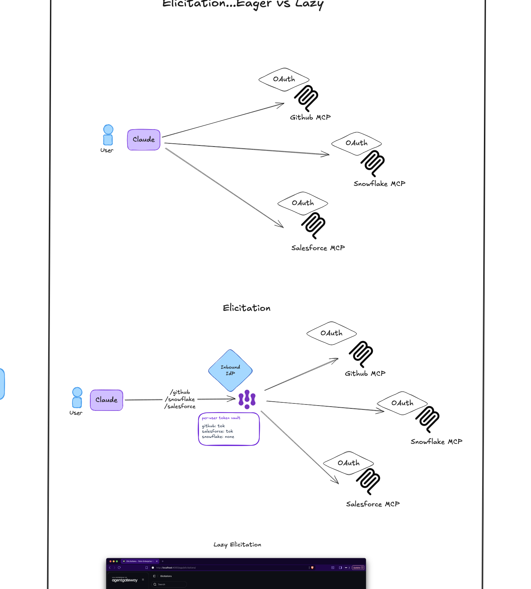

When you put these MCP servers behind agentgateway, one common pattern is **multiplexing** — agentgateway can fan out to multiple MCP servers from a central point and give the user path-based routes to each destination. Elicitation is how agentgateway retrieves and completes this OAuth dance, stores the token in its own storage, and then, on future calls to those MCP servers, swaps in the elicited token to complete the call.

There are two ways we categorize this at a high level: **eager** and **lazy**.

**Eager** means that as soon as you add an MCP server backed by agentgateway to Claude, agentgateway immediately makes you authenticate with the upstream — for example, GitHub's OAuth. So when you add the server, it first makes you authenticate with agentgateway's inbound IdP (Keycloak, Entra, etc.), and then, knowing you'll need GitHub OAuth to use these tools, it sends you through a second login. You log in with Keycloak first, then GitHub. If you add multiple MCPs, you might see several immediate login flows. The upside: you only do these multiple logins at connect time; once connected, you're good, because agentgateway stores the mapping and has all the tokens saved.

**Lazy** elicitation saves a pending elicitation URL when you actually try to call the MCP tool that needs authentication. The user can then log into the agentgateway UI and complete the authorization flow later, asynchronously. Once that's complete, the pending elicitation is resolved and the call can proceed.

All of these patterns are documented well in the Solo documentation — token exchange, elicitation, and so on — and the docs do a good job outlining the concepts. Cory also has an **Agent Auth Patterns workshop** where every one of these is laid out in much more technically accurate detail, with the sequence diagrams and the config, so if you want to implement any of these patterns you can find the exact one. There's also a deck I've used with a couple of prospects that outlines every flow — inbound and outbound — with when to use it and the specific agentgateway configuration and YAML.

---

## Wrap-up and Q&A

**Cory:** I'll put the workshop link in the chat. On the last slide: auth is a competitive advantage for us. There are capability advantages with agentgateway Enterprise over some competitors and over open source, and while that gap is closing — Kong and others in the enterprise space are catching up — the knowledge itself is the advantage. This stuff is complicated, for us and for the prospects we work with. We don't necessarily need to become authN/authZ experts, but knowing how to talk to a prospect, understand their situation, and help them navigate the options builds trusted-advisor status. I think that's a major competitive advantage.

**Eitan:** That's a lot to cover in one hour. I sense everyone would want a follow-up. We'll discuss that.

**Cory:** Any one of these flows could be its own session. This was a shotgun approach — here's where we're thinking.

**Eitan:** Thanks for the overview. We're out of time, so if anyone has a pressing question, go ahead; otherwise reach out to Ram or Cory directly.

**Nathan:** Would you consider running this as a 101 webinar — in fact, a series: 101, 201? I think that would be incredible brand recognition, being the ones showing how this works.

**Ram:** I'd be down with that. It's more effort than what we did today, but yes.

**Nathan:** Honestly, exactly what you did today — that's a fantastic primer. It doesn't all have to be tied to a product pitch; brand recognition comes from educating. Most people can get to "101, create an agent" with zero knowledge of what you showed today, so being the company providing that education is powerful. I'd love to see it as a series — even just break today into three bite-sized sessions.

**Ram:** Agreed. If it's scoped down, we can provide a much better session. Happy to do that.

**Eitan:** We'll discuss the details. Thank you, Ram and Cory, for the content — very much appreciated. If you've got an idea for a future session, reach out.
